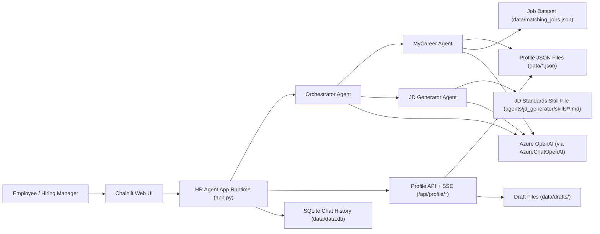
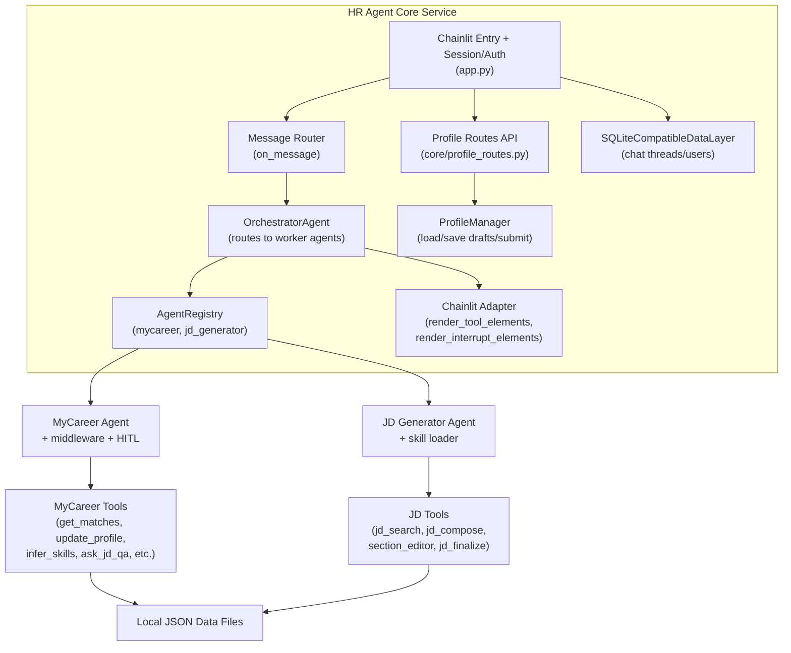
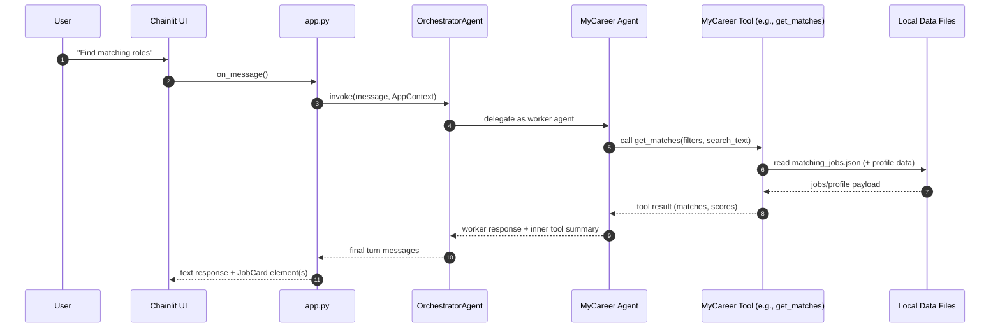
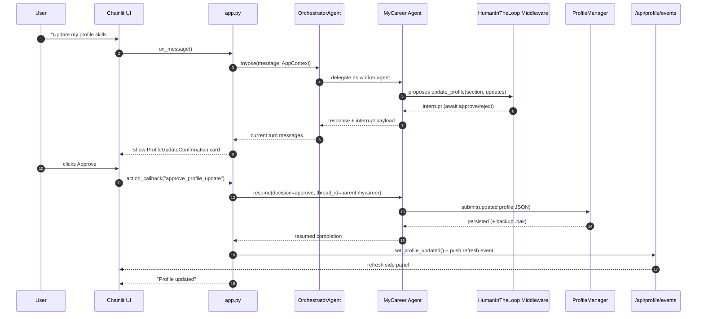

References:

- https://docs.langchain.com/oss/python/langgraph/workflows-agents
- https://docs.langchain.com/oss/python/langchain/multi-agent
- https://blog.apify.com/ai-agent-orchestration
- https://developers.openai.com/cookbook/examples/orchestrating_agents/
- https://developers.googleblog.com/developers-guide-to-multi-agent-patterns-in-adk/
- https://microsoft.github.io/multi-agent-reference-architecture/index.html

## High level notes

Key differences
### The workflow pattern
- Intent detection identifies one intent at a time
- Tool execution is manual (based on the intent)
- Overrides are applied before any action is taken by the agent
- Major development effort and complexity goes to constructing and managing the workflow and graph. (Thorough testing of graph after each change)
- Focus is on  when to execute a tool (most time spend on developing and connecting graphs, adding more routes)
 
 ### ReAct pattern
 - Agent is presented with the tools. It "decides" whether to call it or not
 - Agent can call multiple tools in one go (chaining rules)
 - Overrides are applied using middleware in langchain (callback functions/hooks)
 - Major development work and complexity is in context, memory and error management (Thorough testing of user input/execution patterns after every change)
 - The underlying agents were expanded with more capabilities to test for scalability (It always work in simple straight forward cases like routing to a tool etc). Complex interaction patterns were put to test. 
 - Focus is on when not to execute a tool (most of the time was spend on prompt restricting the agent to available capabilities)
 - Behavior changed from not all scenarios work (workflow) to all scenarios work but sometimes it does more than you expect it to.

### Orchestrator-Worker pattern
- Patterns explored:  supervisor, router, workspace, Swarm
- Orchestrator is well bahaved in most cases. 
- There are edge cases where orchestrator directly talks to the user without handing off to worker agent. 
- Currently orchestrator with react is being used. Haven't found any issues. No current use cases for cross agent chaining. 
- Considering the evolution of orchestrator agent in future, it might be easier to start with a ReAct Agent
- Orchestrator can get complicated with more agents and tools being added. A reasoning and more powerfull model is needed.
- Separation of concerns: Its important to keep the domain specific tasks out of orchestrators purview. Its sole job is to do the hand off
- Orchestrator should not do workers failure/error management
- Orchestator should not rephrase users queries, instead it should pass the messages as is
- Orchestrator should not process the resuls
- An output (Synthesizer) agent was considered but not implemented. None of the current usecases require one. (The orchestrator do not deal with multiple agents and single agent responses are self contained. Multipe agent scenario might need a Synthesizer agent to consolidate the response)
- Thread management: Orchestrator sees the main thread. Worker agents only see their subsets (thread_id:<worker-agent_id>)
- Orchestrator can hit a limit when adding more and more agents (external studies). No limits found during the PoC.
- Worker agents should be self contained
- Ability to add or remove an agent without making breaking changes (open/close - add instead of modify) - Registry
- Communication protocol for Agent to Agent interaction (A2A)
- it might be a good idea to associate capabilities with (bbs?) role
- Tool calls are optional for the model. This creates hallucinations

### Other notes:
- Edge cases can not be avoided in production. There are always unseen execution paths that the model might not have instructed to behave in. The focus should be on avoiding risky edge cases especially write operations.
- It is a good practice to confirm with the user more often.
- What we mainly need is clear distinction of responsibilities of worker agents and clear domain separation so that orchestrator is not ambiguous about the intent that sounds similar (two similar tools). Inorder to avoid this. 
  1. Come up with a predefined HR domain landscape and stick to it (which is very difficult)
  2. Manage a central tracking system of prompts (and agents) and review it for conflicts and ambiguity before adding a new agent or tool. This can be a meta agent who analyzes the prompts. 
- Broad Personas tends to lead to ambigous decision making by orchestrator (Employee vs HM. Sometimes both.). Make the agent role or task based. Not HM but Hiring Assistant agent. This makes it easier for orchestrator to distinguish between different agents and find the boundary.

- MCP and A2A - Talk to Januario on java implementation and find delta
### MCP:
Currently tools are single agent (Dont have to expose to multiple agents)
No thirdparty tools
Can add latency
Might benefit with a mix of local and MCP agents
Local tools can be migrated to MCP when needed to expose to multiple agents.
Need to conduct analsis on complexity of MCP vs Non MCP implementation

### A2A
Since mycareer agent can go to production soon after jd generator, it makes sense to add it right now. Otherwise it is a short amount of time to do the refactoring. 
A2A still need to be integrated into the PoC. Skeleton is implemented but its not being used currently.

### Key implementation aspects
- Context engineering
- Failure management 
- Memory management 
- Logging and monitoring 

## System Context Diagram

Notes:
- This shows where `HR Agent` sits between end users, AI models, and local persistence.
- The orchestrator is the single routing point that delegates to specialist agents.

## Core Component Diagram

Notes:
- `app.py` is the runtime entry and wires auth, routing, and API mounting.
- The adapter layer turns tool outputs into rich UI elements (cards/panels).
- MyCareer includes human-in-the-loop approval for `update_profile` before persistence.

## Sequence Diagram

 notes:
- This is the baseline flow for most requests: route, tool call, respond.
- No interrupt means the turn completes in one pass.
- The adapter renders structured UI elements from tool outputs.

## Sequence Diagram (Profile Update with Approval - HITL)

 notes:
- Profile changes are interrupt-gated: no write until user approves.
- After approval, the UI gets a refresh event to stay in sync.

