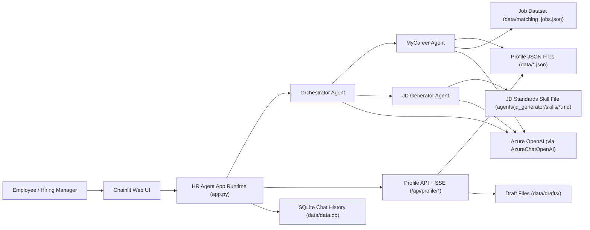
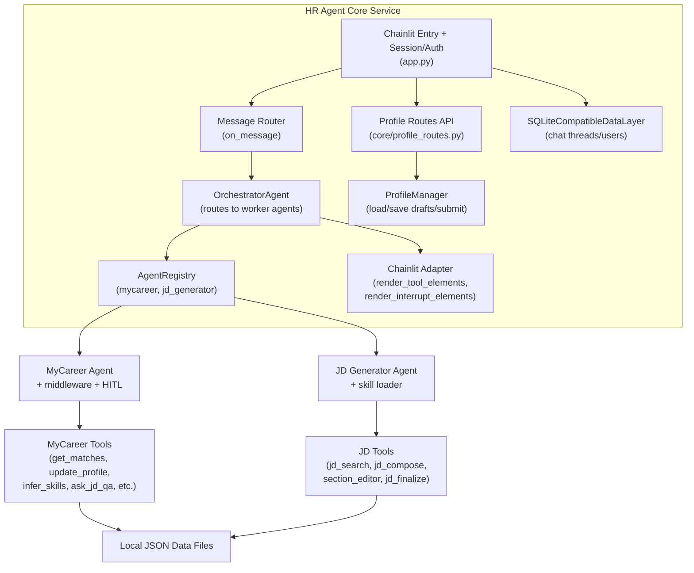
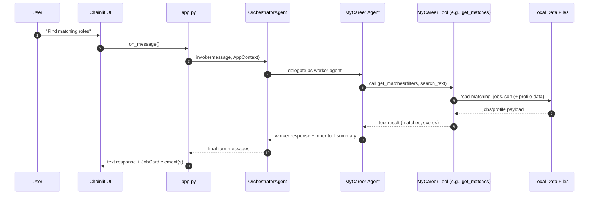
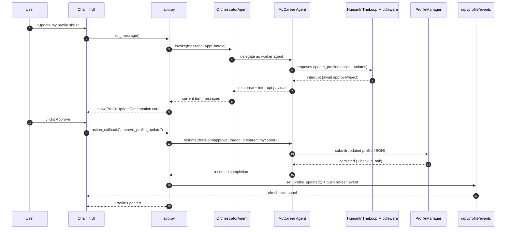

# HR Agent Architecture Diagrams

## 1) System Context Diagram

Notes:
- This shows where `HR Agent` sits between end users, AI models, and local persistence.
- The orchestrator is the single routing point that delegates to specialist agents.
- Profile APIs and SSE support side-panel UX for profile editing and refresh events.

## 2) Core Component Diagram

 notes:
- `app.py` is the runtime entry and wires auth, routing, and API mounting.
- The adapter layer turns tool outputs into rich UI elements (cards/panels).
- MyCareer includes human-in-the-loop approval for `update_profile` before persistence.

## 3) Regular Sequence Diagram (Normal Request, No HITL)

 notes:
- This is the baseline flow for most requests: route, tool call, respond.
- No interrupt means the turn completes in one pass.
- The adapter renders structured UI elements from tool outputs.

## 4) Key Sequence Diagram (Profile Update with Approval)

 notes:
- This is the highest-value flow for trust and control.
- Profile changes are interrupt-gated: no write until user approves.
- After approval, the UI gets a refresh event via SSE to stay in sync.
