# System Architecture Overview

High-level view of how all components interact in the HR Agent multi-agent orchestration system.

## Architecture Diagram

```mermaid
graph TB
    subgraph UI["User Interface"]
        Webapp["HR Assistant App"]
    end

    subgraph App["Application Layer"]
        AppPy["app.py<br/>Lifecycle Hooks"]
    end

    subgraph Orchestration["Orchestration Layer"]
        Orchestrator["OrchestratorAgent<br/>(Routes to Specialists)"]
    end

    subgraph Agents["Specialist Agents"]
        ProfileAgent["ProfileAgent<br/>Profile Analysis & Updates"]
        JobDiscoveryAgent["JobDiscoveryAgent<br/>Job Search & Matching"]
        OutreachAgent["OutreachAgent<br/>Communication & Outreach"]
        JDGenAgent["JDGeneratorAgent<br/>Job Description Authoring"]
        CandidateAgent["CandidateSearchAgent<br/>Employee Directory Search"]
    end

    subgraph Tools["Tool Layer"]
        ProfileTools["Profile Tools<br/>6 tools"]
        JobTools["Job Discovery Tools<br/>3 tools"]
        OutreachTools["Outreach Tools<br/>2 tools"]
        JDTools["JD Generator Tools<br/>6 tools (incl. Skill Loader)"]
        CandidateTools["Candidate Tools<br/>2 tools"]
    end

    subgraph Framework["Core Framework"]
        BaseAgent["BaseAgent<br/>LangChain Wrapper"]
        AgentConfig["AgentConfig<br/>Name, Tools, Middleware"]
        AgentRegistry["AgentRegistry<br/>Agent Discovery"]
        Middleware["Middleware Stack<br/>Summarization, Monitoring,<br/>HITL, Personalization"]
        State["AppContext<br/>Shared State (contextvars)"]
    end

    subgraph Data["Data Layer"]
        Profiles["data/*_profile.json<br/>User Profiles"]
        JobPostings["data/matching_jobs.json<br/>Job Postings"]
        EmployeeDir["data/employee_directory.json<br/>Candidate Directory"]
        SkillsDB["data/skills_ontology.json<br/>Skills Ontology"]
        Requisitions["data/job_requisitions.json<br/>Job Requisitions"]
        ChatDB["data/data.db<br/>Chat History (SQLite)"]
    end

    subgraph Adapters["Adapter Layer"]
        UIAdapter["UI Adapter<br/>Tool Result → UI Elements"]
    end

    subgraph UIElements["UI Components (10)"]
        JobCard["JobCard.jsx"]
        ProfileScore["ProfileScore.jsx"]
        DraftMessage["DraftMessage.jsx"]
        CandidateCard["CandidateCard.jsx"]
        SkillsCard["SkillsCard.jsx"]
        SendConfirmation["SendConfirmation.jsx"]
        ProfileUpdateConfirmation["ProfileUpdateConfirmation.jsx"]
        RequisitionCard["RequisitionCard.jsx"]
        JdQaCard["JdQaCard.jsx"]
        JdFinalizedCard["JdFinalizedCard.jsx"]
    end

    Webapp -->|on_message| AppPy
    AppPy -->|invoke| Orchestrator
    Orchestrator -->|route| ProfileAgent
    Orchestrator -->|route| JobDiscoveryAgent
    Orchestrator -->|route| OutreachAgent
    Orchestrator -->|route| JDGenAgent
    Orchestrator -->|route| CandidateAgent

    ProfileAgent --> ProfileTools
    JobDiscoveryAgent --> JobTools
    OutreachAgent --> OutreachTools
    JDGenAgent --> JDTools
    CandidateAgent --> CandidateTools

    ProfileTools --> Profiles
    JobTools --> JobPostings
    OutreachTools --> Profiles
    JDTools --> Requisitions
    JDTools --> SkillsDB
    CandidateTools --> EmployeeDir

    Orchestrator --> State
    Orchestrator --> AgentRegistry

    ProfileAgent --> BaseAgent
    JobDiscoveryAgent --> BaseAgent
    OutreachAgent --> BaseAgent
    JDGenAgent --> BaseAgent
    CandidateAgent --> BaseAgent

    BaseAgent --> AgentConfig
    BaseAgent --> Middleware

    Orchestrator --> UIAdapter
    UIAdapter --> JobCard
    UIAdapter --> ProfileScore
    UIAdapter --> DraftMessage
    UIAdapter --> CandidateCard
    UIAdapter --> SkillsCard
    UIAdapter --> SendConfirmation
    UIAdapter --> ProfileUpdateConfirmation
    UIAdapter --> RequisitionCard
    UIAdapter --> JdQaCard
    UIAdapter --> JdFinalizedCard

    JobCard --> Webapp
    ProfileScore --> Webapp
    DraftMessage --> Webapp
    CandidateCard --> Webapp
    SkillsCard --> Webapp
    SendConfirmation --> Webapp
    ProfileUpdateConfirmation --> Webapp
    RequisitionCard --> Webapp
    JdQaCard --> Webapp
    JdFinalizedCard --> Webapp

    ChatDB -.->|persistent history| Webapp
```

## Key Components

- **HR Assistant App**: Web-based chat interface with multi-user auth (5 users) and SQLite persistence
- **app.py**: Entry point handling app lifecycle hooks (`on_chat_start`, `on_message`, `on_chat_resume`, action callbacks for HITL)
- **OrchestratorAgent**: Central routing agent that wraps specialists as worker agent tools via `_create_worker_agent()`
- **Specialist Agents**: Domain-specific agents (Profile, Jobs, Outreach, JD Generator, Candidate Search)
- **BaseAgent**: LangChain wrapper providing async `invoke()`/`stream()` with middleware stack and checkpointing
- **Adapters**: Convert tool results to custom React UI components; also handle HITL interrupt rendering
- **Data Layer**: JSON files for profiles/jobs/candidates/skills + SQLite for chat history
- **Middleware**: Cross-cutting concerns (summarization, tool monitoring, employee personalization, HITL interrupts)
