# System Architecture Overview

High-level view of how all components interact in the AutoChat multi-agent orchestration system.

## Architecture Diagram

```mermaid
graph TB
    subgraph UI["User Interface"]
        Chainlit["Chainlit Web UI"]
    end

    subgraph App["Application Layer"]
        AppPy["app.py<br/>Lifecycle Hooks"]
    end

    subgraph Orchestration["Orchestration Layer"]
        Orchestrator["OrchestratorAgent<br/>(Routes to Specialists)"]
    end

    subgraph Agents["Specialist Agents"]
        ProfileAgent["ProfileAgent<br/>Profile Analysis & Updates"]
        JobDiscoveryAgent["JobDiscoveryAgent<br/>Job Search & Matching"]
        OutreachAgent["OutreachAgent<br/>Communication & Outreach"]
        JDGenAgent["JDGeneratorAgent<br/>Job Description Authoring"]
        CandidateAgent["CandidateSearchAgent<br/>Employee Directory Search"]
    end

    subgraph Tools["Tool Layer"]
        ProfileTools["Profile Tools<br/>6 tools"]
        JobTools["Job Discovery Tools<br/>3 tools"]
        OutreachTools["Outreach Tools<br/>3 tools"]
        JDTools["JD Generator Tools<br/>5 tools + Skill Loader"]
        CandidateTools["Candidate Tools<br/>2 tools"]
    end

    subgraph Framework["Core Framework"]
        BaseAgent["BaseAgent<br/>LangChain Wrapper"]
        AgentConfig["AgentConfig<br/>Name, Tools, Middleware"]
        AgentRegistry["AgentRegistry<br/>Agent Discovery"]
        Middleware["Middleware Stack<br/>Summarization, Monitoring"]
        State["AppContext<br/>Shared State (contextvars)"]
    end

    subgraph Data["Data Layer"]
        Profiles["data/profiles.json<br/>User Profiles"]
        JobPostings["data/jobs.json<br/>Job Postings"]
        EmployeeDir["data/employee_directory.json<br/>Candidate Directory"]
        SkillsDB["data/skills.json<br/>Skills Ontology"]
        ChatDB["data/data.db<br/>Chat History"]
    end

    subgraph Adapters["Adapter Layer"]
        ChainlitAdapter["Chainlit Adapter<br/>Tool Result → UI Elements"]
    end

    subgraph UIElements["UI Components"]
        JobCard["JobCard.jsx"]
        ProfileScore["ProfileScore.jsx"]
        DraftMessage["DraftMessage.jsx"]
        CandidateCard["CandidateCard.jsx"]
        SkillsCard["SkillsCard.jsx"]
    end

    Chainlit -->|on_message| AppPy
    AppPy -->|invoke| Orchestrator
    Orchestrator -->|route| ProfileAgent
    Orchestrator -->|route| JobDiscoveryAgent
    Orchestrator -->|route| OutreachAgent
    Orchestrator -->|route| JDGenAgent
    Orchestrator -->|route| CandidateAgent

    ProfileAgent --> ProfileTools
    JobDiscoveryAgent --> JobTools
    OutreachAgent --> OutreachTools
    JDGenAgent --> JDTools
    CandidateAgent --> CandidateTools

    ProfileTools --> Profiles
    JobTools --> JobPostings
    OutreachTools --> Profiles
    JDTools --> SkillsDB
    CandidateTools --> EmployeeDir

    Orchestrator --> State
    Orchestrator --> AgentRegistry

    ProfileAgent --> BaseAgent
    JobDiscoveryAgent --> BaseAgent
    OutreachAgent --> BaseAgent
    JDGenAgent --> BaseAgent
    CandidateAgent --> BaseAgent

    BaseAgent --> AgentConfig
    BaseAgent --> Middleware

    Orchestrator --> ChainlitAdapter
    ChainlitAdapter --> JobCard
    ChainlitAdapter --> ProfileScore
    ChainlitAdapter --> DraftMessage
    ChainlitAdapter --> CandidateCard
    ChainlitAdapter --> SkillsCard

    JobCard --> Chainlit
    ProfileScore --> Chainlit
    DraftMessage --> Chainlit
    CandidateCard --> Chainlit
    SkillsCard --> Chainlit

    ChatDB -.->|persistent history| Chainlit
```

## Key Components

- **Chainlit UI**: Web-based chat interface for user interaction
- **app.py**: Entry point handling Chainlit lifecycle and session management
- **OrchestratorAgent**: Central routing agent that delegates to specialists
- **Specialist Agents**: Domain-specific agents (Profile, Jobs, Outreach, JD, Candidates)
- **BaseAgent**: LangChain wrapper providing async invoke/stream with middleware
- **Adapters**: Convert tool results to custom UI components
- **Data Layer**: JSON files and SQLite for persistence
- **Middleware**: Cross-cutting concerns (summarization, monitoring)
