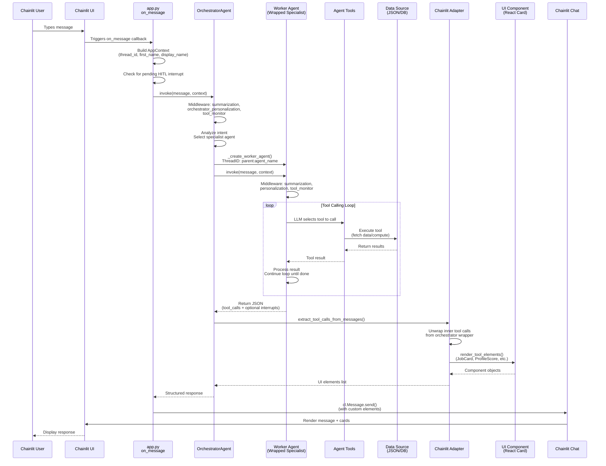
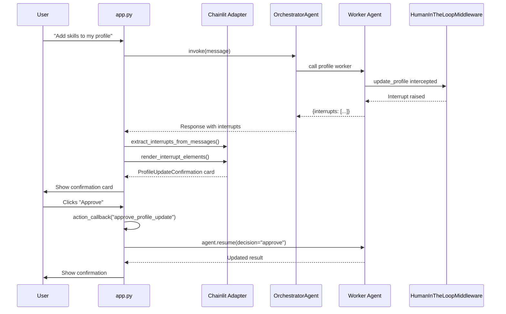

# Message Flow: End-to-End Request Processing

Detailed sequence of how a user message flows through the entire HR Agent system.

## Message Flow Diagram

## HITL Interrupt Flow

## Process Steps

1. **User Input** → Chainlit UI receives message
2. **HITL Check** → app.py checks for pending interrupt from previous turn
3. **Session Context** → app.py builds AppContext (thread_id, first_name, display_name)
4. **Orchestration** → OrchestratorAgent applies middleware, analyzes intent, selects specialist
5. **Worker Agent Invocation** → Specialist agent wrapped as tool with namespaced ThreadID
6. **Specialist Middleware** → Personalization, profile warnings, HITL interception applied
7. **Tool Execution Loop** → Agent iteratively calls tools until task complete
8. **Data Fetching** → Tools query JSON files or compute results
9. **Result Extraction** → `extract_tool_calls_from_messages()` unwraps inner tool calls
10. **Interrupt Extraction** → `extract_interrupts_from_messages()` finds HITL interrupts
11. **UI Adaptation** → `render_tool_elements()` converts results to React components
12. **Response Rendering** → Chainlit displays message with custom UI elements

## Thread ID Namespacing

- Parent thread: `{session_id}`
- Child thread: `{parent_thread_id}:{agent_name}`
- Example: `abc123:profile` (ensures isolated histories per agent)
