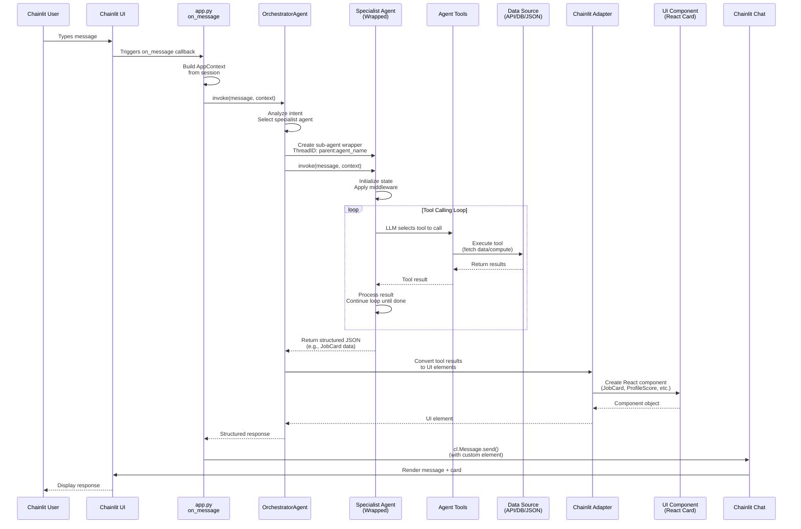

# Message Flow: End-to-End Request Processing

Detailed sequence of how a user message flows through the entire AutoChat system.

## Message Flow Diagram

## Process Steps

1. **User Input** → Chainlit UI receives message
2. **Session Context** → app.py builds AppContext from session
3. **Orchestration** → OrchestratorAgent analyzes intent and selects specialist
4. **Sub-Agent Invocation** → Specialist agent created with namespaced ThreadID
5. **Tool Execution Loop** → Agent iteratively calls tools until task complete
6. **Data Fetching** → Tools query data sources (JSON, APIs, databases)
7. **Result Processing** → Tool results aggregated and structured
8. **UI Adaptation** → ChainlitAdapter converts results to React components
9. **Response Rendering** → Chainlit displays message with custom UI elements
10. **User Sees Result** → Chat shows both text and visual component

## Thread ID Namespacing

- Parent thread: `{session_id}`
- Child thread: `{parent_thread_id}:{agent_name}`
- Example: `abc123:ProfileAgent` (ensures isolated histories per agent)
