# Core Framework Architecture

The foundational components that power agent behavior, configuration, and orchestration.

## Core Framework Diagram

```mermaid
graph TB
    subgraph BaseAgentModule["BaseAgent (core/agent/base.py)"]
        BaseAgent["BaseAgent<br/>async invoke(message, context)<br/>async stream(message, context)<br/>Middleware stack application"]
        Invoke["invoke()<br/>Single response"]
        Stream["stream()<br/>Token streaming"]
        MiddlewareApply["Middleware Processing<br/>Applied in order"]
    end

    subgraph ConfigModule["AgentConfig (core/agent/config.py)"]
        Config["AgentConfig<br/>Dataclass"]
        ConfigName["name: str"]
        ConfigDesc["description: str"]
        ConfigLLM["llm: BaseChatModel"]
        ConfigTools["tools: List[Tool]"]
        ConfigMiddleware["middleware: List[Middleware]"]
        ConfigStateSchema["state_schema: Type"]
        ConfigContextSchema["context_schema: Type"]
        ConfigContextFactory["context_factory: Callable"]
    end

    subgraph RegistryModule["AgentRegistry (core/agent/registry.py)"]
        Registry["AgentRegistry<br/>Thread-safe lookup"]
        RegisterAgent["register(agent_name, agent)"]
        LookupAgent["get(agent_name) → Agent"]
        ListAgents["list_agents() → Names"]
    end

    subgraph StateModule["State Management (core/state.py)"]
        BaseContext["BaseContext<br/>Parent class for context"]
        AppContext["AppContext<br/>Application-wide context<br/>contextvars.ContextVar"]
        ContextVars["ContextVar<br/>Thread-safe context"]
        SessionData["Session data<br/>Profile, preferences, etc."]
    end

    subgraph LLMModule["LLM Factory (core/llm.py)"]
        LLMFactory["get_llm(temperature)<br/>Singleton factory"]
        AzureOpenAI["Azure OpenAI Client<br/>Thread-safe"]
    end

    subgraph ProfileModule["Profile Management (core/profile.py)"]
        LoadProfile["load_profile()<br/>JSON caching"]
        ProfilePath["PROFILE_PATH env var"]
        ProfileData["User profile data"]
    end

    subgraph SkillModule["Skill Registry (core/skills/)"]
        Skill["Skill<br/>Knowledge unit"]
        SkillRegistry["SkillRegistry<br/>Dynamic loading"]
        LoaderTool["create_skill_loader_tool()<br/>LangChain tool"]
        SkillContent["Skill content<br/>Fetched at runtime"]
    end

    subgraph ProtocolModule["A2A Protocol (core/agent/protocol.py)"]
        Task["Task<br/>Agent work unit"]
        TaskState["TaskState<br/>Execution state"]
        TaskMessage["TaskMessage<br/>Inter-agent message"]
        AgentCard["AgentCard<br/>UI representation"]
        AgentSkill["AgentSkill<br/>Capability descriptor"]
    end

    BaseAgent --> Invoke
    BaseAgent --> Stream
    BaseAgent --> MiddlewareApply

    Config --> ConfigName
    Config --> ConfigDesc
    Config --> ConfigLLM
    Config --> ConfigTools
    Config --> ConfigMiddleware
    Config --> ConfigStateSchema
    Config --> ConfigContextSchema
    Config --> ConfigContextFactory

    Registry --> RegisterAgent
    Registry --> LookupAgent
    Registry --> ListAgents

    AppContext --> BaseContext
    AppContext --> ContextVars
    ContextVars --> SessionData

    LLMFactory --> AzureOpenAI

    LoadProfile --> ProfilePath
    LoadProfile --> ProfileData

    SkillRegistry --> Skill
    SkillRegistry --> LoaderTool
    LoaderTool --> SkillContent

    BaseAgent -->|uses| Config
    BaseAgent -->|retrieves| Registry
    BaseAgent -->|accesses| AppContext
    BaseAgent -->|gets LLM| LLMFactory
    BaseAgent -->|applies middleware| MiddlewareApply

    Config -->|references| AppContext
    Config -->|defines tools| SkillModule

    Registry -->|stores| BaseAgent

    LoadProfile -->|populates| AppContext
    SkillRegistry -->|provides tools| Config
```

## Component Responsibilities

### BaseAgent
- Wraps LangChain's agent creation
- Supports async `invoke()` for single responses
- Supports async `stream()` for token streaming
- Applies middleware stack in order to state

### AgentConfig
- **name**: Agent identifier
- **description**: Purpose/capabilities
- **llm**: Azure OpenAI language model
- **tools**: LangChain tools available to agent
- **middleware**: Ordered list of middleware functions
- **state_schema**: Pydantic model for agent state
- **context_schema**: Type for AppContext
- **context_factory**: Callable to build context

### AgentRegistry
- Singleton registry for agent lookup
- Thread-safe registration and retrieval
- Enables dynamic agent discovery

### AppContext
- Global context passed via `contextvars.ContextVar`
- Avoids global state across async calls
- Contains session data, user profile, preferences

### LLM Factory
- Singleton Azure OpenAI client
- Thread-safe model access
- Supports temperature configuration

### Profile Management
- Loads user profile JSON with caching
- Path configurable via `PROFILE_PATH` env var

### Skill Registry
- Dynamic skill loading at runtime
- Creates LangChain tools for agents to fetch skill content
- Used by JD Generator and other agents

### A2A Protocol
- Inter-agent communication types
- Task, TaskState, TaskMessage for structured workflows
- AgentCard, AgentSkill for UI and capability description
