# Core Framework Architecture

The foundational components that power agent behavior, configuration, and orchestration.

## Core Framework Diagram

```mermaid
graph TB
    subgraph BaseAgentModule["BaseAgent (core/agent/base.py)"]
        BaseAgent["BaseAgent<br/>async invoke(message, context)<br/>async stream(message, context)<br/>get_state() / resume()<br/>Middleware stack application"]
        Invoke["invoke()<br/>Single response"]
        Stream["stream()<br/>Token streaming"]
        MiddlewareApply["Middleware Processing<br/>Applied in order"]
    end

    subgraph ConfigModule["AgentConfig (core/agent/config.py)"]
        Config["AgentConfig<br/>Dataclass"]
        ConfigName["name: str"]
        ConfigDesc["description: str"]
        ConfigLLM["llm: BaseChatModel"]
        ConfigTools["tools: List[Tool]"]
        ConfigSystemPrompt["system_prompt: str"]
        ConfigMiddleware["middleware: List[Middleware]"]
        ConfigStateSchema["state_schema: Type"]
        ConfigContextSchema["context_schema: Type"]
        ConfigCheckpointer["checkpointer: BaseCheckpointSaver"]
        ConfigContextFactory["context_factory: Callable"]
    end

    subgraph RegistryModule["AgentRegistry (core/agent/registry.py)"]
        Registry["AgentRegistry<br/>Thread-safe lookup"]
        RegisterAgent["register(agent_name, agent)"]
        LookupAgent["get(agent_name) → Agent"]
        ListAgents["list_agents() → Names"]
        ContainsAgent["__contains__(name) → bool"]
    end

    subgraph StateModule["State Management (core/state.py)"]
        BaseContext["BaseContext<br/>thread_id: str"]
        AppContext["AppContext(BaseContext)<br/>first_name: str<br/>display_name: str"]
        ContextVars["ContextVar<br/>Thread-safe context"]
    end

    subgraph LLMModule["LLM Factory (core/llm.py)"]
        LLMFactory["get_llm(temperature)<br/>Singleton factory"]
        AzureOpenAI["Azure OpenAI Client<br/>Thread-safe"]
    end

    subgraph ProfileModule["Profile Management"]
        LoadProfile["load_profile()<br/>core/profile.py<br/>JSON caching"]
        ProfilePath["PROFILE_PATH env var<br/>default: data/miro_profile.json"]
        ProfileScore["compute_completion_score()<br/>core/profile_score.py"]
        ProfileSchema["profile_schema.py<br/>Section registry & validation"]
        ProfileManager["ProfileManager<br/>core/profile_manager.py<br/>Backup & restore"]
        ProfileRoutes["profile_routes.py<br/>FastAPI routes for editor"]
    end

    subgraph SkillModule["Skill Registry (core/skills/)"]
        Skill["Skill<br/>name, description, path, tags<br/>lazy content loading"]
        SkillRegistry["SkillRegistry<br/>Dynamic loading"]
        LoaderTool["create_skill_loader_tool()<br/>LangChain tool"]
        SkillContent["Skill content<br/>Fetched at runtime"]
    end

    subgraph ProtocolModule["A2A Protocol (core/agent/protocol.py)"]
        Task["Task<br/>id, state, messages, metadata"]
        TaskState["TaskState<br/>SUBMITTED | WORKING |<br/>INPUT_REQUIRED | COMPLETED | FAILED"]
        TaskResult["TaskResult<br/>task_id, state, messages, artifacts"]
        TaskMessage["TaskMessage<br/>role, content, metadata"]
        AgentCard["AgentCard<br/>name, description, skills, url"]
        AgentSkill["AgentSkill<br/>name, description, tags"]
    end

    BaseAgent --> Invoke
    BaseAgent --> Stream
    BaseAgent --> MiddlewareApply

    Config --> ConfigName
    Config --> ConfigDesc
    Config --> ConfigLLM
    Config --> ConfigTools
    Config --> ConfigSystemPrompt
    Config --> ConfigMiddleware
    Config --> ConfigStateSchema
    Config --> ConfigContextSchema
    Config --> ConfigCheckpointer
    Config --> ConfigContextFactory

    Registry --> RegisterAgent
    Registry --> LookupAgent
    Registry --> ListAgents
    Registry --> ContainsAgent

    AppContext --> BaseContext
    AppContext --> ContextVars

    LLMFactory --> AzureOpenAI

    LoadProfile --> ProfilePath
    LoadProfile --> ProfileScore
    ProfileScore --> ProfileSchema
    ProfileManager --> LoadProfile

    SkillRegistry --> Skill
    SkillRegistry --> LoaderTool
    LoaderTool --> SkillContent

    BaseAgent -->|uses| Config
    BaseAgent -->|retrieves| Registry
    BaseAgent -->|accesses| AppContext
    BaseAgent -->|gets LLM| LLMFactory
    BaseAgent -->|applies middleware| MiddlewareApply

    Config -->|references| AppContext
    Config -->|defines tools| SkillModule

    Registry -->|stores| BaseAgent

    LoadProfile -->|populates| AppContext
    SkillRegistry -->|provides tools| Config
```

## Component Responsibilities

### BaseAgent
- Wraps LangChain's agent creation
- Supports async `invoke()` for single responses
- Supports async `stream()` for token streaming
- Supports `get_state()` and `resume()` for HITL interrupt handling
- Applies middleware stack in order to state

### AgentConfig
- **name**: Agent identifier
- **description**: Purpose/capabilities
- **llm**: Azure OpenAI language model
- **tools**: LangChain tools available to agent
- **system_prompt**: System prompt string
- **middleware**: Ordered list of middleware functions
- **state_schema**: Pydantic model for agent state
- **context_schema**: Type for context
- **checkpointer**: LangGraph checkpoint saver for state persistence
- **context_factory**: Callable to build context from thread_id

### AgentRegistry
- Singleton registry for agent lookup
- Thread-safe registration and retrieval
- Enables dynamic agent discovery
- Supports `__contains__` for membership check

### AppContext
- `BaseContext` provides `thread_id: str`
- `AppContext` extends with `first_name: str` and `display_name: str`
- Passed via `contextvars.ContextVar` for async isolation
- No global state — each async task gets its own context

### LLM Factory
- Singleton Azure OpenAI client
- Thread-safe model access
- Default temperature: 0.7

### Profile Management
- **load_profile()**: Loads user profile JSON with module-level caching
- **compute_completion_score()**: Returns % completion (0-100)
- **normalize_profile()**: Normalizes structure for consistent rendering
- **ProfileManager**: Handles backup creation and rollback for profile changes
- **profile_routes.py**: FastAPI routes mounted on the webapp for profile editor panel
- Path configurable via `PROFILE_PATH` env var (default: `data/miro_profile.json`)

### Skill Registry
- `Skill` dataclass with lazy content loading via `load_content()`
- `SkillRegistry` for dynamic skill registration and lookup
- `create_skill_loader_tool()` creates a LangChain tool for agents to fetch skill content
- Used by JD Generator agent (1 registered skill: `jd_standards`)

### A2A Protocol
- Inter-agent communication types
- `Task` / `TaskState` / `TaskResult` for structured agent workflows
- `TaskMessage` for inter-agent messages with role and content
- `AgentCard` / `AgentSkill` for capability advertisement
- `AgentProtocol` base class with `send_task()` interface
