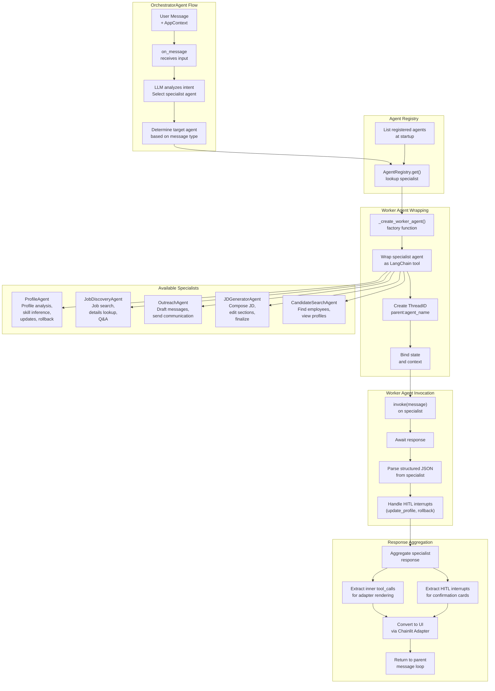
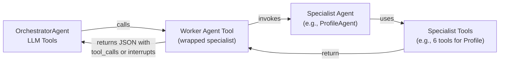
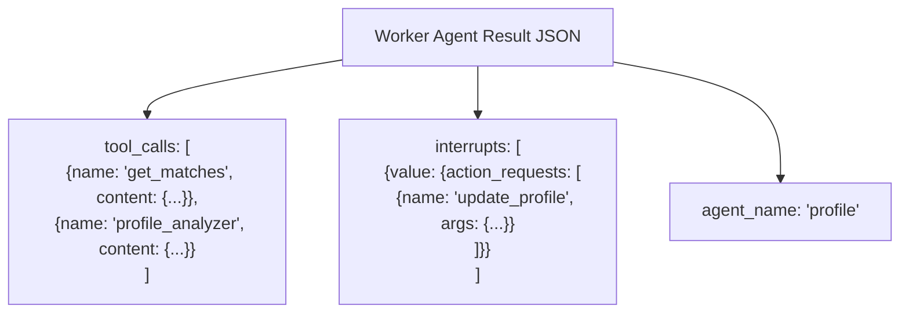
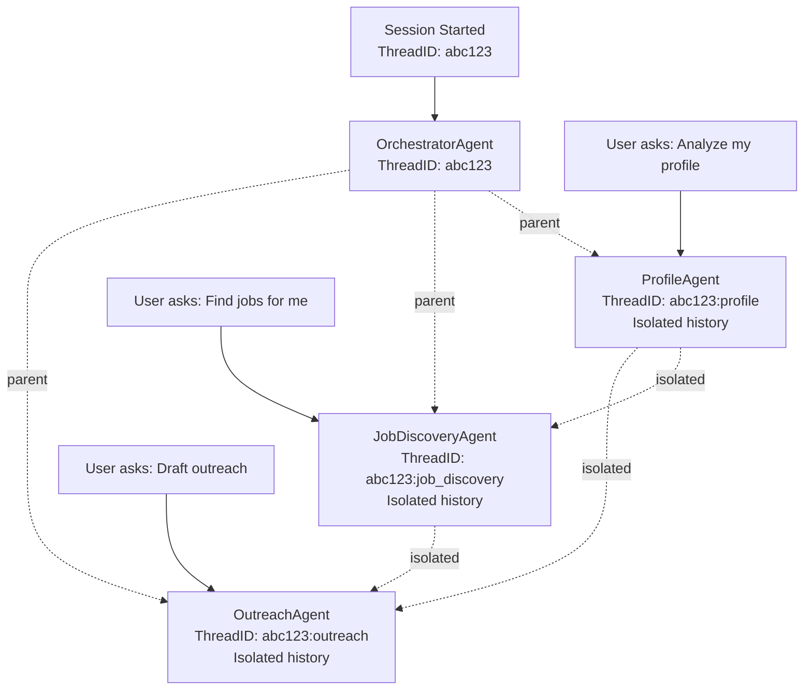
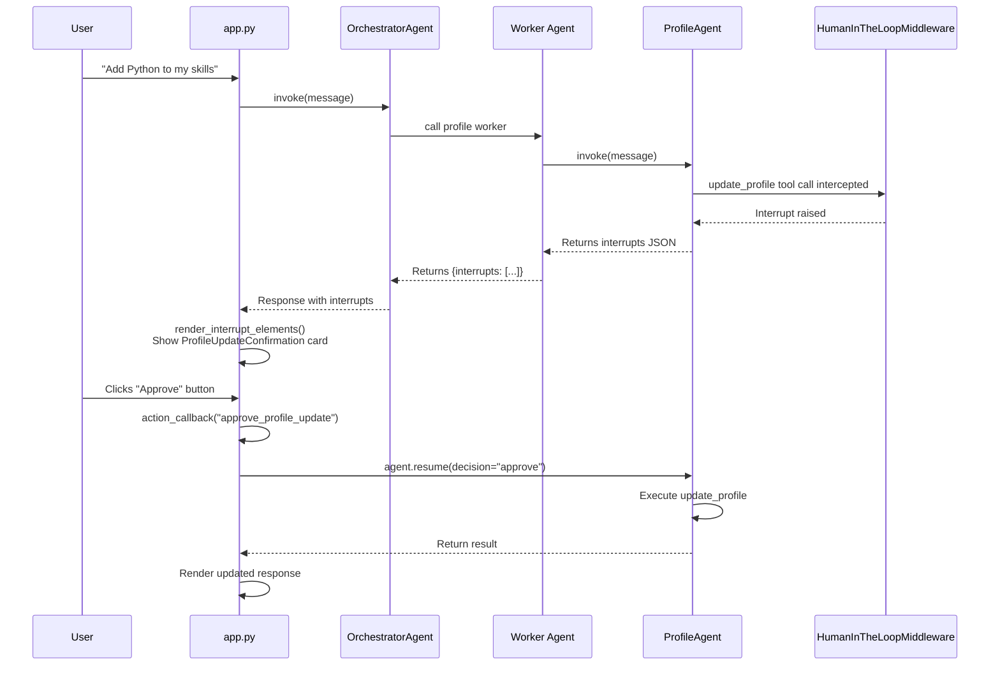

# Orchestrator Pattern

How the OrchestratorAgent discovers, wraps, and delegates to specialist agents.

## Orchestrator Architecture Diagram

## Worker Agent Tool Integration

## Worker Agent Return Format

The worker agent wrapper extracts inner tool calls and HITL interrupts from specialist responses:

## ThreadID Namespacing

## HITL Interrupt Flow

## Key Design Patterns

### 1. **Worker Agent Wrapping**
- Each specialist agent is dynamically wrapped as a LangChain tool via `_create_worker_agent()`
- Orchestrator can compose specialists without tight coupling
- Worker tools return JSON with `tool_calls` (inner results) and `interrupts` (HITL)

### 2. **ThreadID Namespacing**
- Parent thread: `{session_id}`
- Child thread: `{parent_thread_id}:{agent_name}`
- Prevents conversation history cross-contamination
- Each agent has isolated context and tool history

### 3. **Dynamic Registration**
- Agents registered in `agents/catalog.py`
- Orchestrator discovers agents at runtime via AgentRegistry
- Adding new agent requires only:
  1. Create agent
  2. Register in catalog
  3. Orchestrator auto-discovers it

### 4. **Structured Routing**
- Orchestrator LLM analyzes user intent
- Routes to best-fit specialist based on message content
- Specialist executes independently with full context
- Results aggregated and adapted for UI

### 5. **Human-in-the-Loop**
- Profile updates and rollbacks require user confirmation
- `HumanInTheLoopMiddleware` intercepts specified tool calls
- Interrupts bubble up through worker agent → orchestrator → app.py
- User approves/rejects via UI card action callbacks
- Agent resumes with decision via `agent.resume()`
