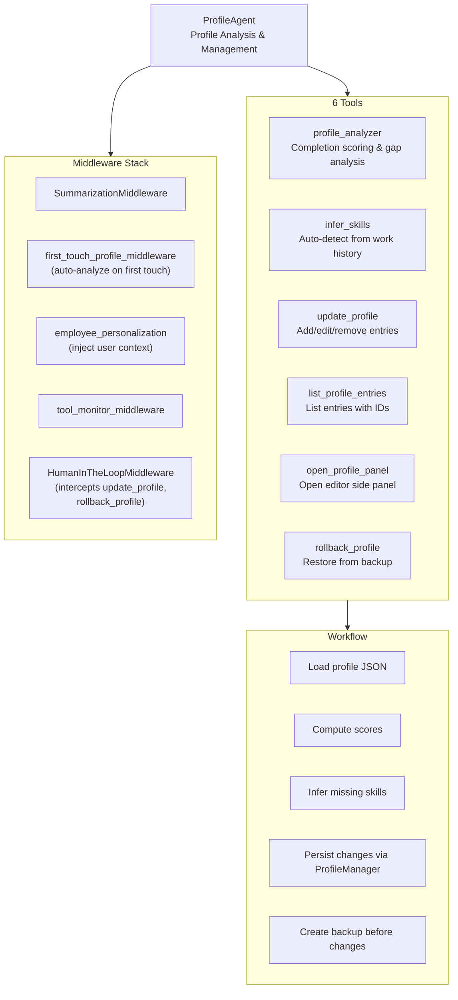
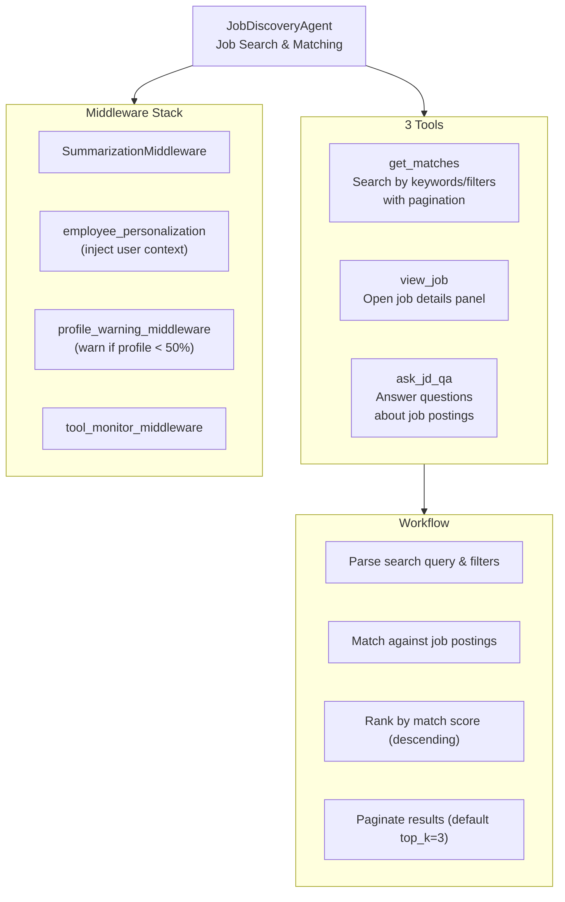
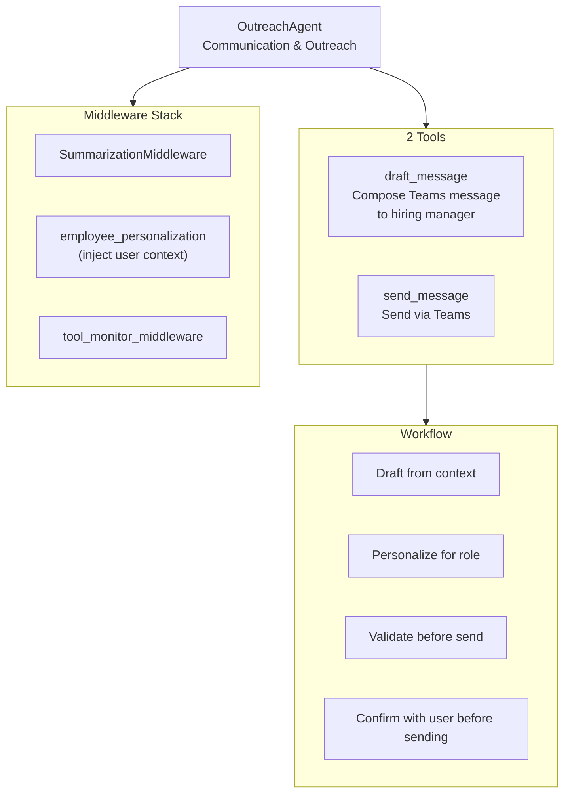
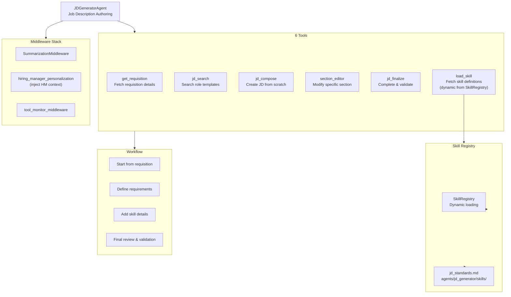
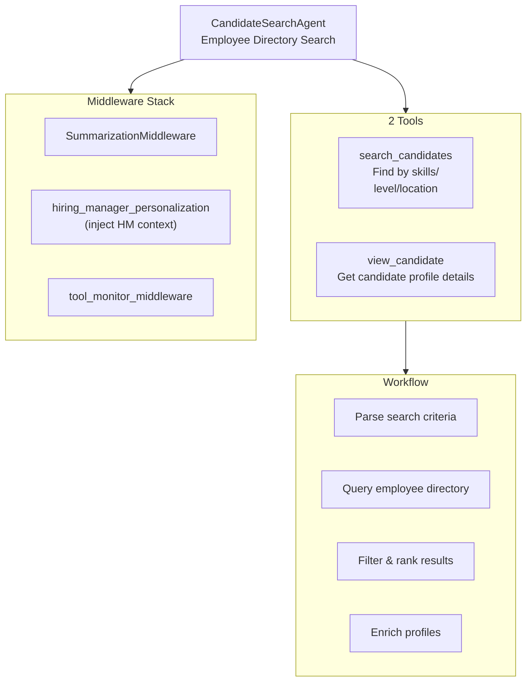
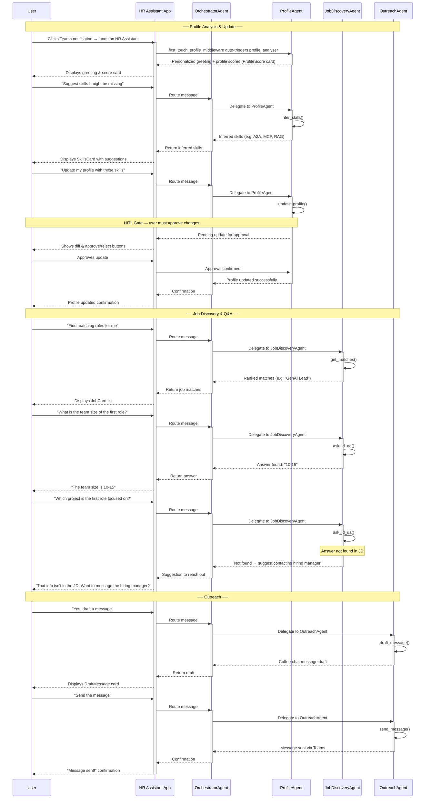

# Specialist Agents Architecture

Detailed breakdown of each specialist agent and their tool sets.

## Specialist Agents Overview

```mermaid
graph TB
    subgraph Profile["ProfileAgent<br/>agents/profile/"]
        P1["profile_analyzer<br/>Profile scoring & analysis"]
        P2["infer_skills<br/>Auto-detect skills"]
        P3["update_profile<br/>CRUD on experience and skills sections"]
        P4["list_profile_entries<br/>List section entries & IDs"]
        P5["open_profile_panel<br/>Open editor panel"]
        P6["rollback_profile<br/>Restore from backup"]
        PData["data/*_profile.json"]
    end

    subgraph JobD["JobDiscoveryAgent<br/>agents/job_discovery/"]
        J1["get_matches<br/>Search & filter job postings"]
        J2["view_job<br/>Display job details panel"]
        J3["ask_jd_qa<br/>Q&A on job descriptions"]
        JData["data/matching_jobs.json"]
    end

    subgraph Outreach["OutreachAgent<br/>agents/outreach/"]
        O1["draft_message<br/>Compose outreach message"]
        O2["send_message<br/>Send via Teams"]
        OData["data/*_profile.json"]
    end

    subgraph JDGen["JDGeneratorAgent<br/>agents/jd_generator/"]
        JG1["get_requisition<br/>Fetch requisition details"]
        JG2["jd_search<br/>Search role templates"]
        JG3["jd_compose<br/>Create job description"]
        JG4["section_editor<br/>Modify JD sections"]
        JG5["jd_finalize<br/>Complete & validate JD"]
        JG6["load_skill<br/>Fetch skill definitions"]
        JGData["data/job_requisitions.json<br/>data/skills_ontology.json<br/>agents/jd_generator/skills/"]
    end

    subgraph Candidate["CandidateSearchAgent<br/>agents/candidate_search/"]
        C1["search_candidates<br/>Find employees<br/>by skill/level/location"]
        C2["view_candidate<br/>Get candidate profile"]
        CData["data/employee_directory.json"]
    end

    P1 --> PData
    P2 --> PData
    P3 --> PData
    P4 --> PData
    P5 --> PData
    P6 --> PData

    J1 --> JData
    J2 --> JData
    J3 --> JData

    O1 --> OData
    O2 --> OData

    JG1 --> JGData
    JG2 --> JGData
    JG3 --> JGData
    JG4 --> JGData
    JG5 --> JGData
    JG6 --> JGData

    C1 --> CData
    C2 --> CData

    %% Backend tools — soft green
    style P1 fill:#d4edda,stroke:#4a8c6f,color:#1b4332
    style P2 fill:#d4edda,stroke:#4a8c6f,color:#1b4332
    style P4 fill:#d4edda,stroke:#4a8c6f,color:#1b4332
    style J1 fill:#d4edda,stroke:#4a8c6f,color:#1b4332
    style J3 fill:#d4edda,stroke:#4a8c6f,color:#1b4332
    style O1 fill:#d4edda,stroke:#4a8c6f,color:#1b4332
    style O2 fill:#d4edda,stroke:#4a8c6f,color:#1b4332
    style JG1 fill:#d4edda,stroke:#4a8c6f,color:#1b4332
    style JG5 fill:#d4edda,stroke:#4a8c6f,color:#1b4332
    style JG6 fill:#d4edda,stroke:#4a8c6f,color:#1b4332
    style C1 fill:#d4edda,stroke:#4a8c6f,color:#1b4332

    %% Frontend tools — soft lavender
    style P3 fill:#e8e0f0,stroke:#7a6cb5,color:#3b2d5e
    style P5 fill:#e8e0f0,stroke:#7a6cb5,color:#3b2d5e
    style P6 fill:#e8e0f0,stroke:#7a6cb5,color:#3b2d5e
    style J2 fill:#e8e0f0,stroke:#7a6cb5,color:#3b2d5e
    style JG2 fill:#e8e0f0,stroke:#7a6cb5,color:#3b2d5e
    style JG3 fill:#e8e0f0,stroke:#7a6cb5,color:#3b2d5e
    style JG4 fill:#e8e0f0,stroke:#7a6cb5,color:#3b2d5e
    style C2 fill:#e8e0f0,stroke:#7a6cb5,color:#3b2d5e
```

**Color key:** Backend tools (server-executed) | Frontend tools (client-executed, UI actions & HITL)

## Agent Detail: ProfileAgent

## Agent Detail: JobDiscoveryAgent

## Agent Detail: OutreachAgent

## Agent Detail: JDGeneratorAgent

## Agent Detail: CandidateSearchAgent

## Shared Tools (11 tools in agents/shared/tools/)

Used by Profile, Job Discovery, and Outreach agents:

| # | Tool | File | Used By |
|---|------|------|---------|
| 1 | `profile_analyzer` | `profile_analyzer.py` | Profile |
| 2 | `update_profile` | `update_profile.py` | Profile |
| 3 | `infer_skills` | `infer_skills.py` | Profile |
| 4 | `list_profile_entries` | `list_profile_entries.py` | Profile |
| 5 | `open_profile_panel` | `open_profile_panel.py` | Profile |
| 6 | `rollback_profile` | `rollback_profile.py` | Profile |
| 7 | `get_matches` | `get_matches.py` | Job Discovery |
| 8 | `view_job` | `view_job.py` | Job Discovery |
| 9 | `ask_jd_qa` | `ask_jd_qa.py` | Job Discovery |
| 10 | `draft_message` | `draft_message.py` | Outreach |
| 11 | `send_message` | `send_message.py` | Outreach |

## Tool Distribution Summary

| Agent | Tool Count | Tools |
|-------|-----------|-------|
| **Profile** | 6 | profile_analyzer, update_profile, infer_skills, list_profile_entries, open_profile_panel, rollback_profile |
| **Job Discovery** | 3 | get_matches, view_job, ask_jd_qa |
| **Outreach** | 2 | draft_message, send_message |
| **Candidate Search** | 2 | search_candidates, view_candidate |
| **JD Generator** | 6 | get_requisition, jd_search, jd_compose, section_editor, jd_finalize, load_skill |
| **Total** | **19** | |

## AG-UI Tool Classification

Tools classified per the [AG-UI (Agent-User Interaction Protocol)](https://docs.ag-ui.com/) model.

### Definitions

- **Frontend tools** ([docs.ag-ui.com/concepts/tools](https://docs.ag-ui.com/concepts/tools)) — "Tools are defined in the frontend and passed to the agent during execution." The frontend defines the tool schema and executes the handler locally. The agent streams `ToolCallStart → ToolCallArgs → ToolCallEnd` to request execution; the frontend executes and returns `ToolCallResult` to the agent. Examples from AG-UI docs: `confirmAction`, `navigateTo`, `fetchUserData`.
- **Backend tools** ([docs.ag-ui.com overview](https://docs.ag-ui.com/)) — "Visualize backend tool outputs in app and chat, emit side effects as first-class events." Tools attached to the agent backend, executed server-side. The frontend is notified and renders results (generative UI) but does NOT execute the tool.

### Classification Test

**Who executes the tool handler?** Frontend → frontend tool. Backend → backend tool.

- **Frontend tool**: Tool controls the UI (SSE panel events) or gates on user decision (HITL interrupt/callback). The frontend executes the action or decision and returns the result to the agent.
- **Backend tool**: Tool computes, queries, generates, or sends server-side. Frontend renders output as generative UI (custom elements) but does not execute the tool. Even if the card has buttons, if they only use `populateChatInput()` it's still backend — that's a chat suggestion, not frontend tool execution.

### Frontend Tools (8)

| # | Tool | Agent | AG-UI Rationale |
|---|------|-------|----------------|
| 1 | `open_profile_panel` | Profile | Pure UI navigation. Triggers `push_panel_event` SSE to open profile editor side panel. No server computation. AG-UI equivalent: `navigateTo`-style tool where frontend owns the panel-open action. |
| 2 | `update_profile` | Profile | HITL gate. `HumanInTheLoopMiddleware` returns `interrupt` payload → agent blocks → frontend renders Approve/Reject card → user clicks → `@action_callback` resumes agent with decision. AG-UI equivalent: `confirmAction`. |
| 3 | `rollback_profile` | Profile | HITL gate. Same interrupt/callback mechanism as `update_profile`. Agent blocks until frontend returns user's approve/reject decision. |
| 4 | `view_job` | Job Discovery | UI navigation. Triggers SSE to open job details panel. Fetches job data but primary action is panel control. Same `navigateTo` pattern. |
| 5 | `jd_search` | JD Generator | UI panel control + data. Triggers `push_panel_event("open_jd_editor", data={...})` SSE at app.py:436. Opens JD Editor side panel and passes search results. The panel open is a frontend action. |
| 6 | `jd_compose` | JD Generator | UI panel control + state persistence. Saves draft to `JDDraftManager` at app.py:444, then triggers `push_panel_event("refresh_jd_editor")` SSE. The panel refresh with new content is a frontend action. |
| 7 | `section_editor` | JD Generator | UI panel control + state persistence. Updates section in `JDDraftManager` via `update_section()` at app.py:455, then triggers `push_panel_event("refresh_jd_editor")` SSE. Same pattern as `jd_compose`. |
| 8 | `view_candidate` | Candidate Search | Frontend tool — will open a candidate profile panel via SSE, matching the `view_job` pattern. 

### Backend Tools (11)

| # | Tool | Agent | AG-UI Rationale |
|---|------|-------|----------------|
| 1 | `profile_analyzer` | Profile | Server computes completion scores, section scores, gap analysis. Returns structured data → frontend renders ProfileScore card. Pure computation, no UI control. |
| 2 | `infer_skills` | Profile | Server runs ML inference on work history to suggest skills. Returns skills with evidence → frontend renders SkillsCard. Pure inference, no UI control. |
| 3 | `list_profile_entries` | Profile | Server queries profile section metadata (entries with IDs). Returns data. No custom UI element, no SSE. Pure data query. |
| 4 | `get_matches` | Job Discovery | Server searches, filters, ranks job postings against profile. Returns ranked matches → frontend renders JobCard grid. Pure search/ranking. |
| 5 | `ask_jd_qa` | Job Discovery | Server runs RAG pipeline over job descriptions to answer questions. Returns answer with citations → frontend renders JdQaCard. Pure computation. |
| 6 | `draft_message` | Outreach | Server generates draft message text. Returns draft → frontend renders DraftMessage card. Card buttons use `populateChatInput()` (chat input suggestion only — not SSE, not HITL, not `@action_callback`). No `HumanInTheLoopMiddleware` on OutreachAgent. |
| 7 | `send_message` | Outreach | Server sends Teams message. Returns confirmation → frontend renders SendConfirmation card. No HITL middleware, no `@action_callback`, no SSE. The "draft before send" rule is enforced by the LLM system prompt in `agents/outreach/prompts.py`, not middleware. |
| 8 | `get_requisition` | JD Generator | Server fetches open job requisitions. Returns requisition data → frontend renders RequisitionCard. Pure data fetch. |
| 9 | `jd_finalize` | JD Generator | Server marks JD as finalized. Returns status/timestamp → frontend renders JdFinalizedCard. No SSE, no panel control, no interrupt. Display-only card. |
| 10 | `load_skill` | JD Generator | Server fetches skill definition text from SkillRegistry. Returns raw string for LLM context. No UI rendering at all. Pure internal data lookup. |
| 11 | `search_candidates` | Candidate Search | Server queries employee directory by skills/level/location filters. Returns candidates with match scores → frontend renders CandidateCard grid. Pure search. |

### Distribution by Agent

| Agent | Frontend | Backend | Total |
|-------|:--------:|:-------:|:-----:|
| **Profile** | 3 (open_profile_panel, update_profile, rollback_profile) | 3 (profile_analyzer, infer_skills, list_profile_entries) | 6 |
| **Job Discovery** | 1 (view_job) | 2 (get_matches, ask_jd_qa) | 3 |
| **Outreach** | 0 | 2 (draft_message, send_message) | 2 |
| **JD Generator** | 3 (jd_search, jd_compose, section_editor) | 3 (get_requisition, jd_finalize, load_skill) | 6 |
| **Candidate Search** | 1 (view_candidate) | 1 (search_candidates) | 2 |
| **Total** | **8** | **11** | **19** |

---

## Happy Flow: MyCareer Profile → Job Discovery → Outreach

The sequence diagram below shows the end-to-end control and data flow for the MyCareer happy-flow scenario — from the initial Teams notification through profile analysis, skill updates, job matching, JD Q&A, and outreach message send.

