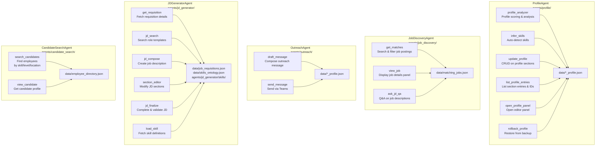
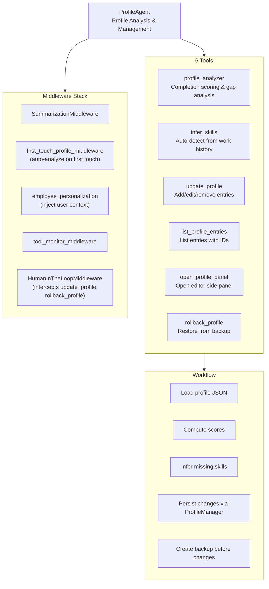
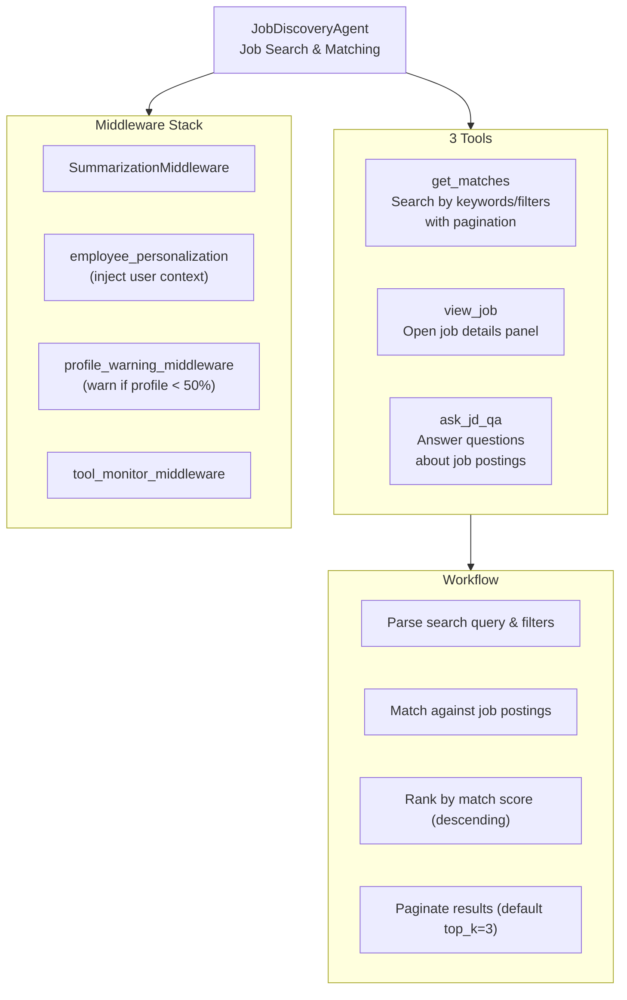
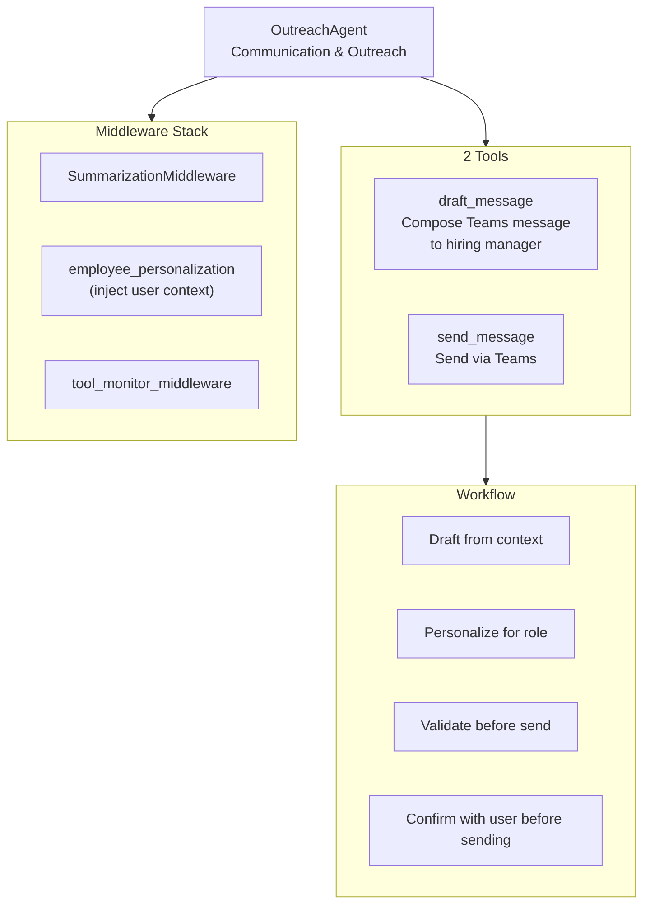
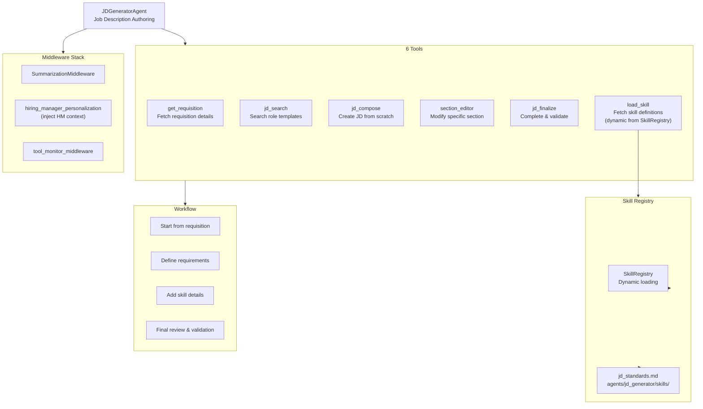
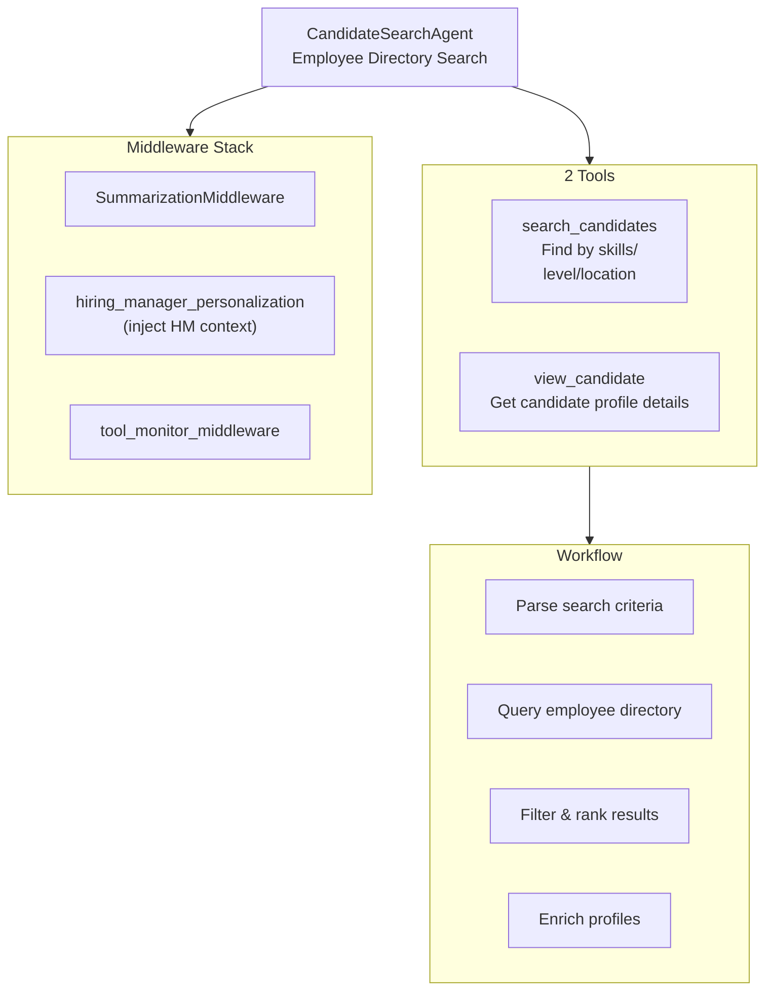

# Specialist Agents Architecture

Detailed breakdown of each specialist agent and their tool sets.

## Specialist Agents Overview

## Agent Detail: ProfileAgent

## Agent Detail: JobDiscoveryAgent

## Agent Detail: OutreachAgent

## Agent Detail: JDGeneratorAgent

## Agent Detail: CandidateSearchAgent

## Shared Tools (11 tools in agents/shared/tools/)

Used by Profile, Job Discovery, and Outreach agents:

| # | Tool | File | Used By |
|---|------|------|---------|
| 1 | `profile_analyzer` | `profile_analyzer.py` | Profile |
| 2 | `update_profile` | `update_profile.py` | Profile |
| 3 | `infer_skills` | `infer_skills.py` | Profile |
| 4 | `list_profile_entries` | `list_profile_entries.py` | Profile |
| 5 | `open_profile_panel` | `open_profile_panel.py` | Profile |
| 6 | `rollback_profile` | `rollback_profile.py` | Profile |
| 7 | `get_matches` | `get_matches.py` | Job Discovery |
| 8 | `view_job` | `view_job.py` | Job Discovery |
| 9 | `ask_jd_qa` | `ask_jd_qa.py` | Job Discovery |
| 10 | `draft_message` | `draft_message.py` | Outreach |
| 11 | `send_message` | `send_message.py` | Outreach |

## Tool Distribution Summary

| Agent | Tool Count | Tools |
|-------|-----------|-------|
| **Profile** | 6 | profile_analyzer, update_profile, infer_skills, list_profile_entries, open_profile_panel, rollback_profile |
| **Job Discovery** | 3 | get_matches, view_job, ask_jd_qa |
| **Outreach** | 2 | draft_message, send_message |
| **Candidate Search** | 2 | search_candidates, view_candidate |
| **JD Generator** | 6 | get_requisition, jd_search, jd_compose, section_editor, jd_finalize, load_skill |
| **Total** | **19** | |
