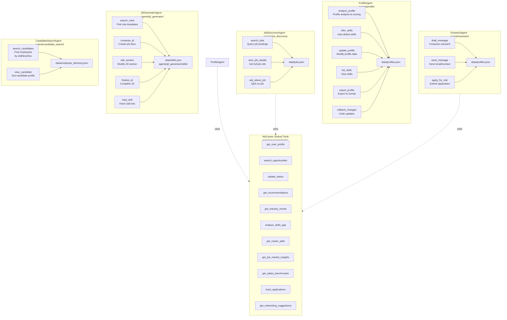
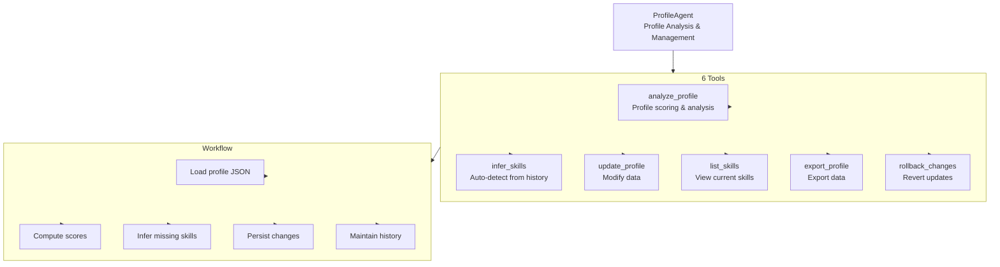
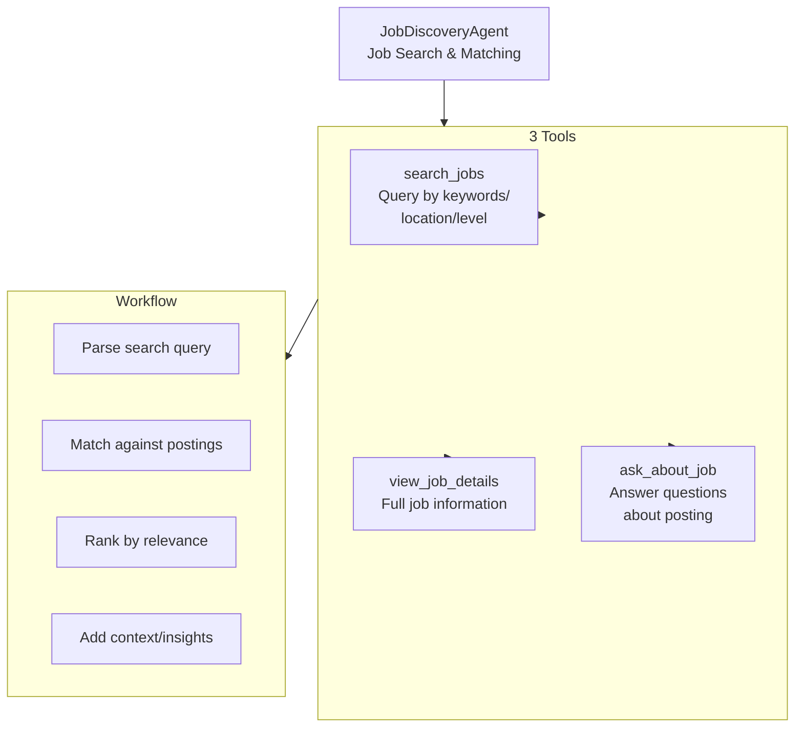
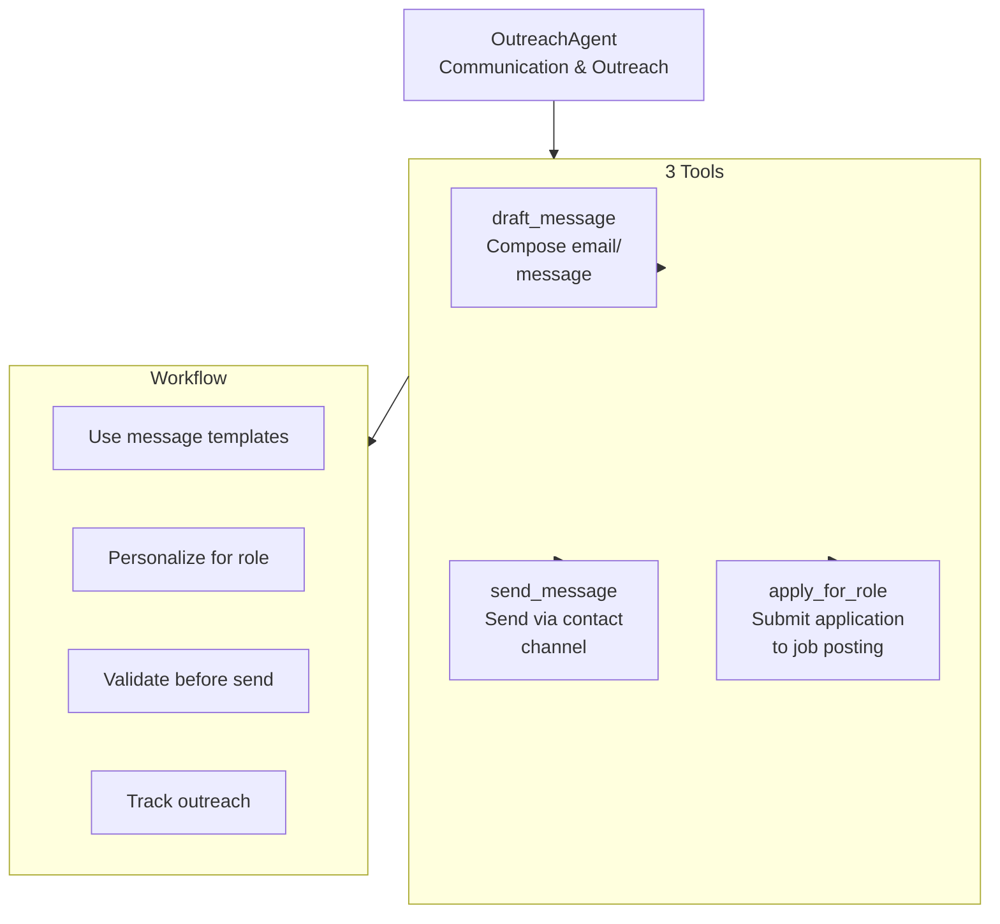
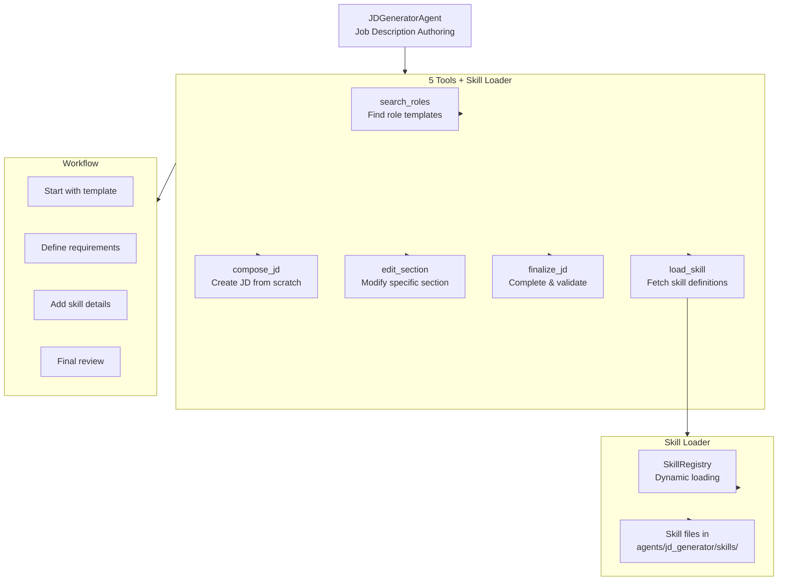
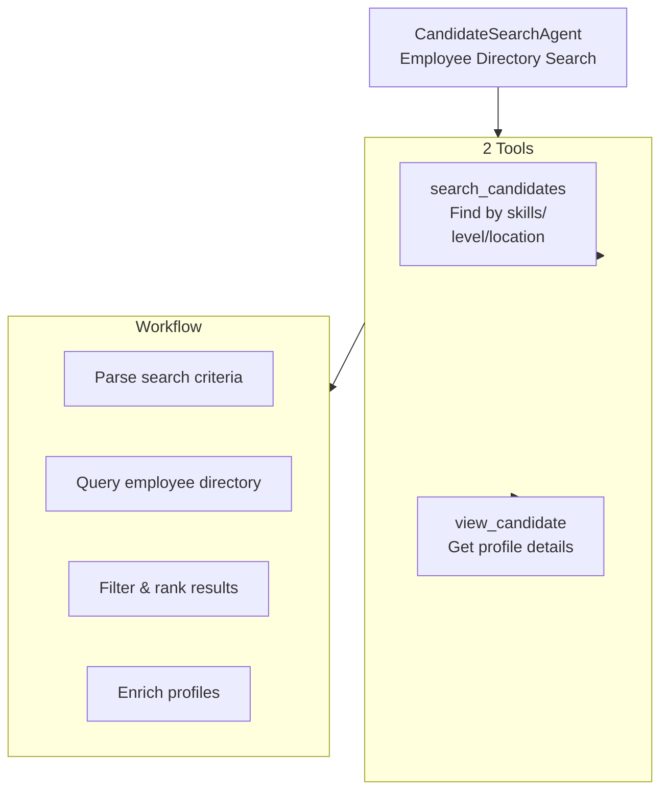

# Specialist Agents Architecture

Detailed breakdown of each specialist agent and their tool sets.

## Specialist Agents Overview

## Agent Detail: ProfileAgent

## Agent Detail: JobDiscoveryAgent

## Agent Detail: OutreachAgent

## Agent Detail: JDGeneratorAgent

## Agent Detail: CandidateSearchAgent

## MyCareer Shared Tools (11 tools)

Used by Profile, Job Discovery, and Outreach agents:

1. `get_user_profile` — Fetch user profile
2. `search_opportunities` — Search jobs/roles
3. `update_status` — Update career status
4. `get_recommendations` — Career recommendations
5. `get_industry_trends` — Industry data
6. `analyze_skills_gap` — Skills gap analysis
7. `get_career_path` — Career progression paths
8. `get_job_market_insights` — Market intelligence
9. `get_salary_benchmarks` — Salary data
10. `track_applications` — Application tracking
11. `get_networking_suggestions` — Networking tips
