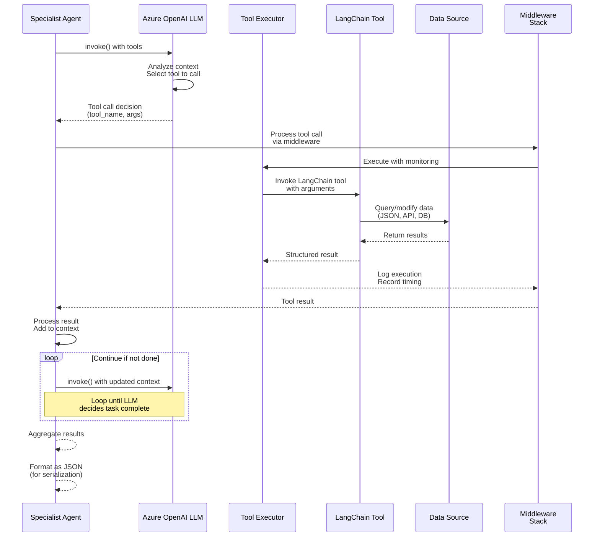
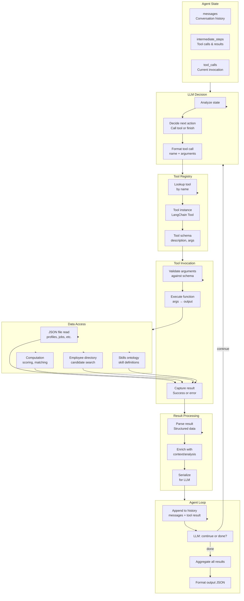

# Tool Execution Pipeline

How tools are called, executed, and results are converted to UI elements.

## Tool Execution Flow

## Tool Execution Detailed View

## UI Adaptation Pipeline

```mermaid
graph TB
    subgraph AgentOutput["Agent Output<br/>(JSON from tool_calls)"]
        JobData["get_matches<br/>{matches, total_available, has_more}"]
        ProfileData["profile_analyzer<br/>{completionScore, sectionScores}"]
        SkillsData["infer_skills<br/>{topSkills, additionalSkills, evidence}"]
        MessageData["draft_message<br/>{recipient_name, message_body}"]
        SendData["send_message<br/>{success, recipient_name, sent_at}"]
        QAData["ask_jd_qa<br/>{answer, citations, job_title}"]
        UpdateData["update_profile<br/>{section, updated_fields, scores}"]
        CandidateData["search_candidates<br/>{candidates, total_available}"]
        ReqData["get_requisition<br/>{requisitions}"]
        FinalizeData["jd_finalize<br/>{finalized_at, next_steps}"]
    end

    subgraph Adapter["UI Adapter<br/>(core/adapters/chainlit_adapter.py)"]
        RenderTool["render_tool_elements()"]
        RenderInterrupt["render_interrupt_elements()"]
        ExtractCalls["extract_tool_calls_from_messages()"]
    end

    subgraph Components["React Components<br/>(public/elements/)"]
        JobCard["JobCard.jsx<br/>Job listing grid"]
        ProfileScore["ProfileScore.jsx<br/>Completion gauge"]
        SkillsCard["SkillsCard.jsx<br/>Interactive skill selection"]
        DraftMessage["DraftMessage.jsx<br/>Message preview"]
        SendConfirmation["SendConfirmation.jsx<br/>Send confirmation"]
        JdQaCard["JdQaCard.jsx<br/>Q&A with citations"]
        ProfileUpdateConfirmation["ProfileUpdateConfirmation.jsx<br/>HITL approval card"]
        CandidateCard["CandidateCard.jsx<br/>Candidate grid"]
        RequisitionCard["RequisitionCard.jsx<br/>Requisition details"]
        JdFinalizedCard["JdFinalizedCard.jsx<br/>Finalization summary"]
    end

    subgraph WebappUI["HR Assistant App"]
        Message["cl.Message<br/>with custom elements"]
        Display["Browser render"]
        Interaction["User interaction<br/>clicks, approvals"]
    end

    JobData --> RenderTool
    ProfileData --> RenderTool
    SkillsData --> RenderTool
    MessageData --> RenderTool
    SendData --> RenderTool
    QAData --> RenderTool
    CandidateData --> RenderTool
    ReqData --> RenderTool
    FinalizeData --> RenderTool
    UpdateData --> RenderTool
    UpdateData --> RenderInterrupt

    RenderTool --> JobCard
    RenderTool --> ProfileScore
    RenderTool --> SkillsCard
    RenderTool --> DraftMessage
    RenderTool --> SendConfirmation
    RenderTool --> JdQaCard
    RenderTool --> CandidateCard
    RenderTool --> RequisitionCard
    RenderTool --> JdFinalizedCard
    RenderInterrupt --> ProfileUpdateConfirmation

    JobCard --> Message
    ProfileScore --> Message
    SkillsCard --> Message
    DraftMessage --> Message
    SendConfirmation --> Message
    JdQaCard --> Message
    ProfileUpdateConfirmation --> Message
    CandidateCard --> Message
    RequisitionCard --> Message
    JdFinalizedCard --> Message

    Message --> Display
    Display --> Interaction
```

## Tool → UI Component Mapping

| Tool | UI Component | Rendering |
|------|-------------|-----------|
| `get_matches` | `JobCard` | Grid of job cards with pagination |
| `profile_analyzer` | `ProfileScore` | Completion gauge + section scores |
| `infer_skills` | `SkillsCard` | Interactive skill selection with evidence |
| `draft_message` | `DraftMessage` | Message preview with edit/send flow |
| `send_message` | `SendConfirmation` | Confirmation with recipient and timestamp |
| `ask_jd_qa` | `JdQaCard` | Q&A answer with citations |
| `update_profile` | `ProfileUpdateConfirmation` | Before/after diff with approve/reject (HITL) |
| `rollback_profile` | `ProfileUpdateConfirmation` | Before/after diff with approve/reject (HITL) |
| `search_candidates` | `CandidateCard` | Candidate grid with match indicators |
| `get_requisition` | `RequisitionCard` | Requisition details |
| `jd_finalize` | `JdFinalizedCard` | Finalization summary with next steps |
| `jd_compose` / `section_editor` | *(SSE panel)* | JD Editor side panel via SSE events |
| `jd_search` | *(SSE panel)* | JD Editor side panel via SSE events |
| `open_profile_panel` | *(side panel)* | Profile editor panel slides in |
| `view_candidate` | `CandidateCard` + *(side panel)* | Candidate detail card + candidate panel via SSE |
| `view_job` | *(side panel)* | Job details panel slides in |

## Key Points

1. **LLM Decision Loop** — Agent keeps looping until LLM decides task is complete
2. **Middleware Wrapping** — Each tool call is wrapped in middleware chain
3. **Tool Registry Lookup** — Tools resolved dynamically by name
4. **Data Source Abstraction** — Tools query JSON files or compute results in-process
5. **Orchestrator Unwrapping** — `extract_tool_calls_from_messages()` unwraps inner tool calls from worker agent wrappers
6. **HITL Rendering** — `render_interrupt_elements()` generates approval cards for profile changes
7. **Rich UI Components** — 10 React components with Teams-style styling
8. **SSE Panels** — JD editor and profile editor use server-sent events for side panel rendering
9. **Streaming Support** — Results can be streamed back to UI in real-time
