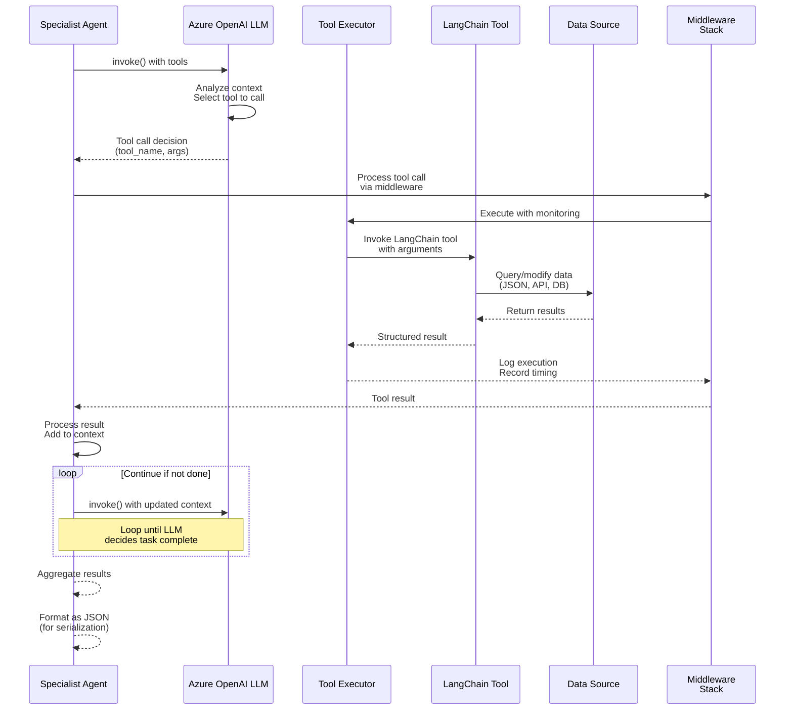
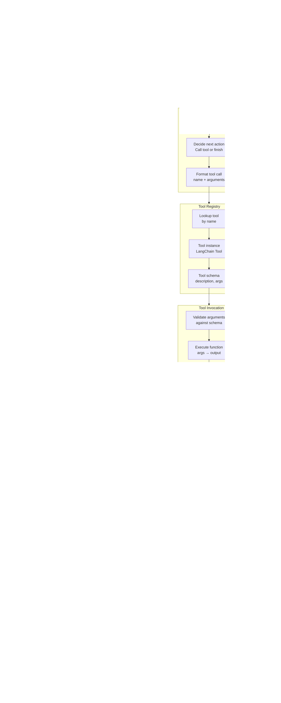
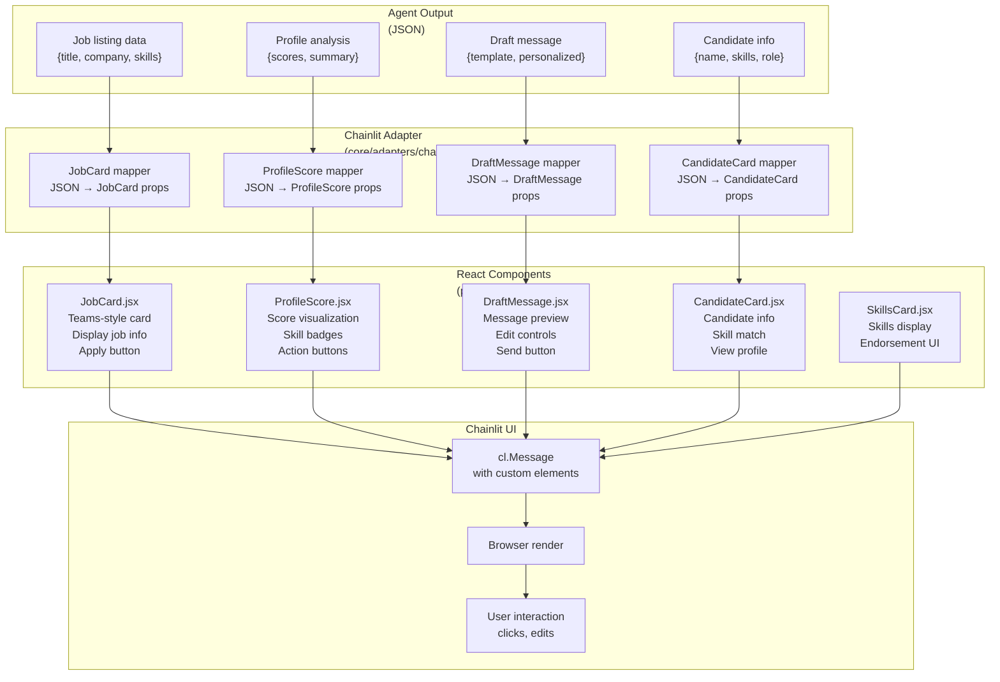
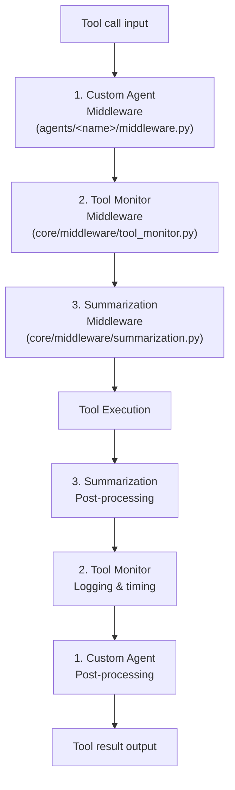
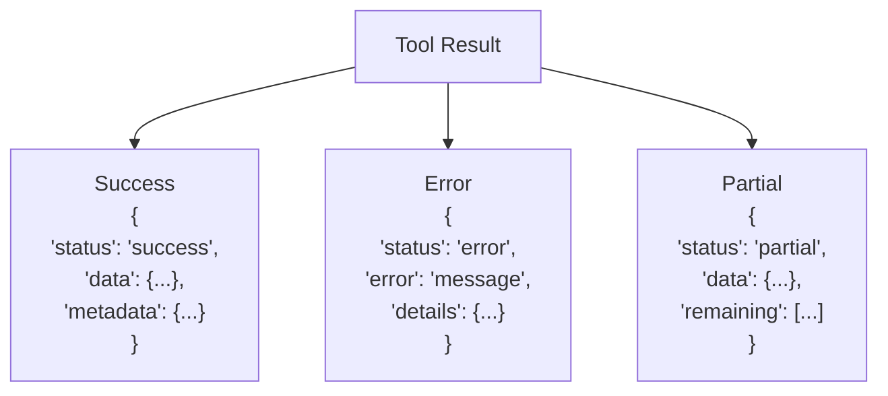

# Tool Execution Pipeline

How tools are called, executed, and results are converted to UI elements.

## Tool Execution Flow

## Tool Execution Detailed View

## UI Adaptation Pipeline

## Middleware Execution Order

## Tool Result Format

## Key Points

1. **LLM Decision Loop** — Agent keeps looping until LLM decides task is complete
2. **Middleware Wrapping** — Each tool call is wrapped in middleware chain
3. **Tool Registry Lookup** — Tools resolved dynamically by name
4. **Data Source Abstraction** — Tools can query JSON, APIs, databases, or compute
5. **UI Adaptation** — Agent JSON results mapped to React components via adapter
6. **Rich UI Components** — Teams-style cards with interaction handlers
7. **Streaming Support** — Results can be streamed back to UI in real-time
