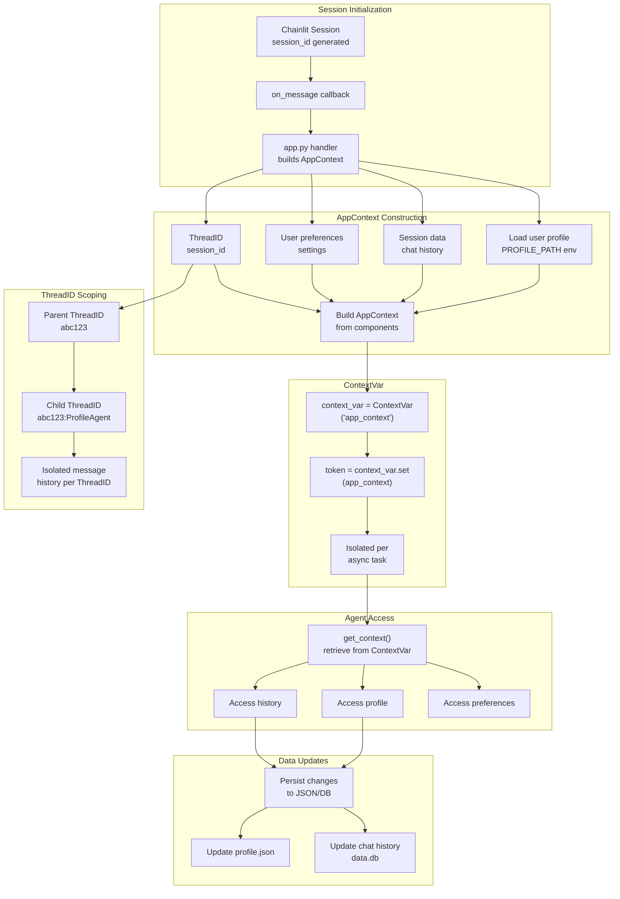
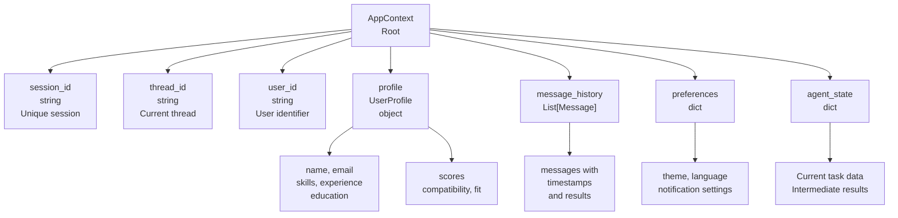
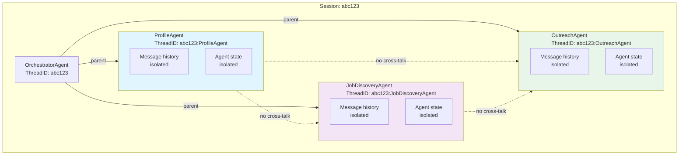
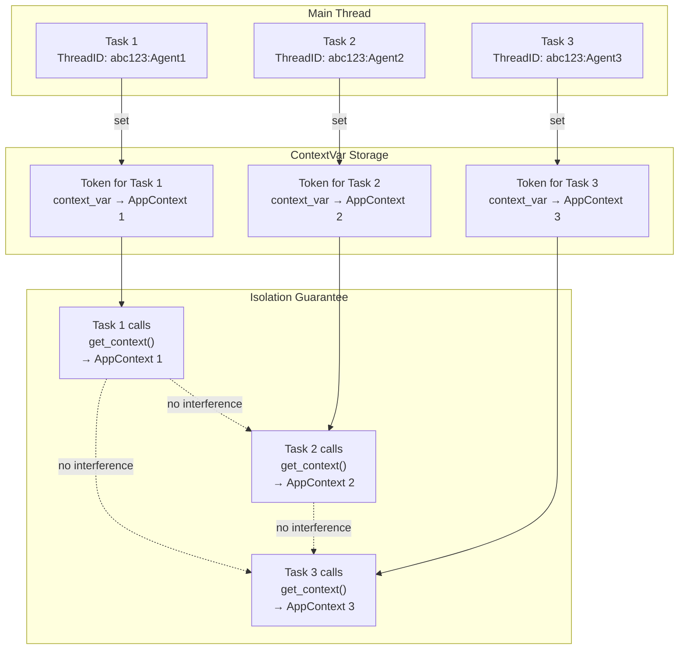
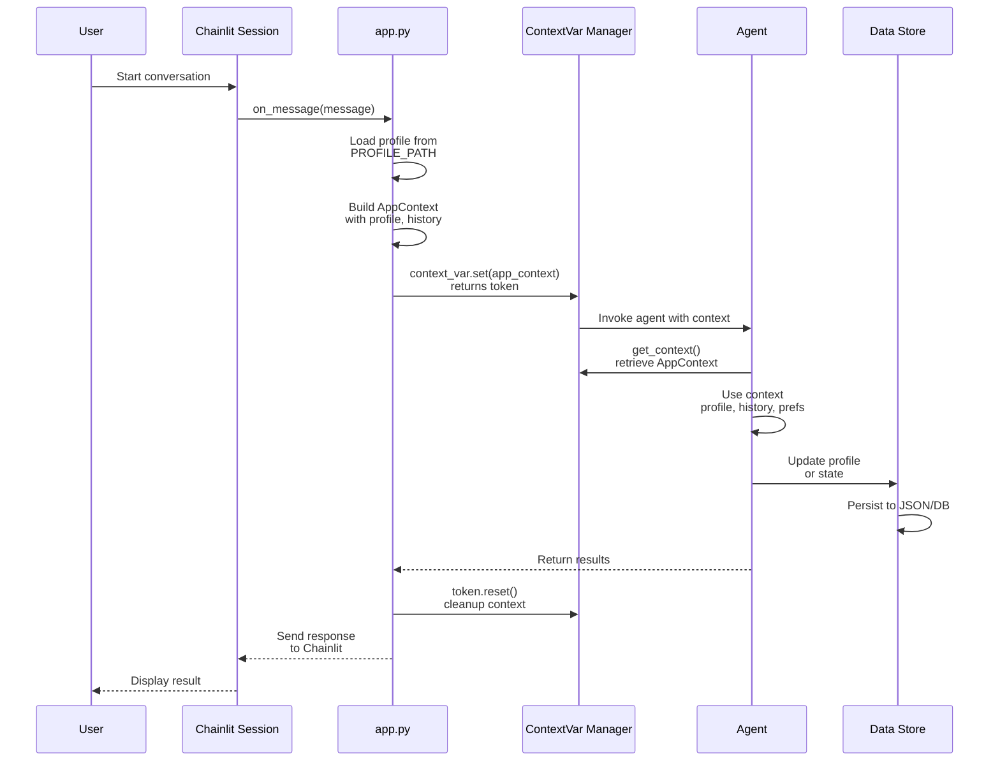
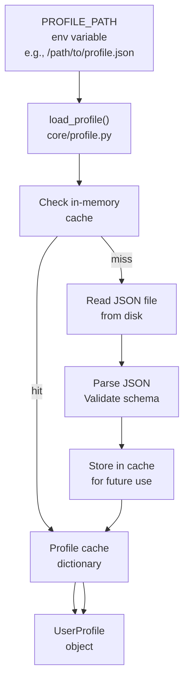
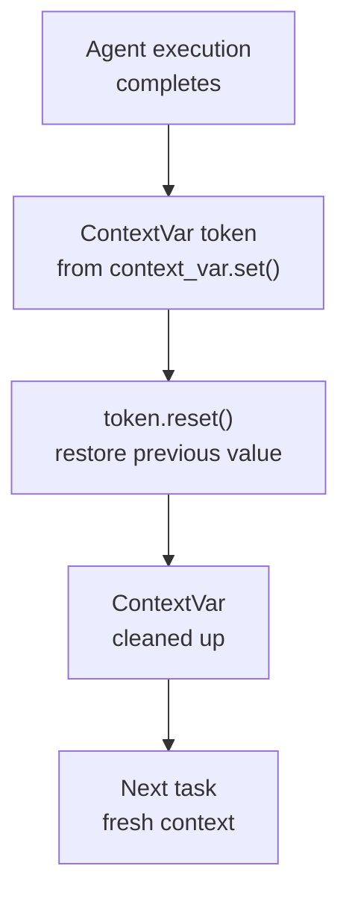

# State Management Architecture

How application state flows through the system and how threading is isolated via context variables.

## AppContext Flow

## AppContext Data Structure

## ThreadID Isolation Model

## Async Isolation via ContextVar

## State Lifecycle

## Profile Caching

## Context Cleanup

## Key Design Principles

1. **ContextVar Isolation** — Each async task gets its own AppContext via contextvars
2. **ThreadID Namespacing** — Parent:Child hierarchy prevents history cross-contamination
3. **Profile Caching** — User profile loaded once and cached for session
4. **Preference Persistence** — User settings maintained across conversation
5. **Cleanup** — ContextVar tokens reset after agent execution
6. **No Global State** — All context passed explicitly, enabling concurrent requests
7. **Session Binding** — AppContext tied to Chainlit session lifecycle
