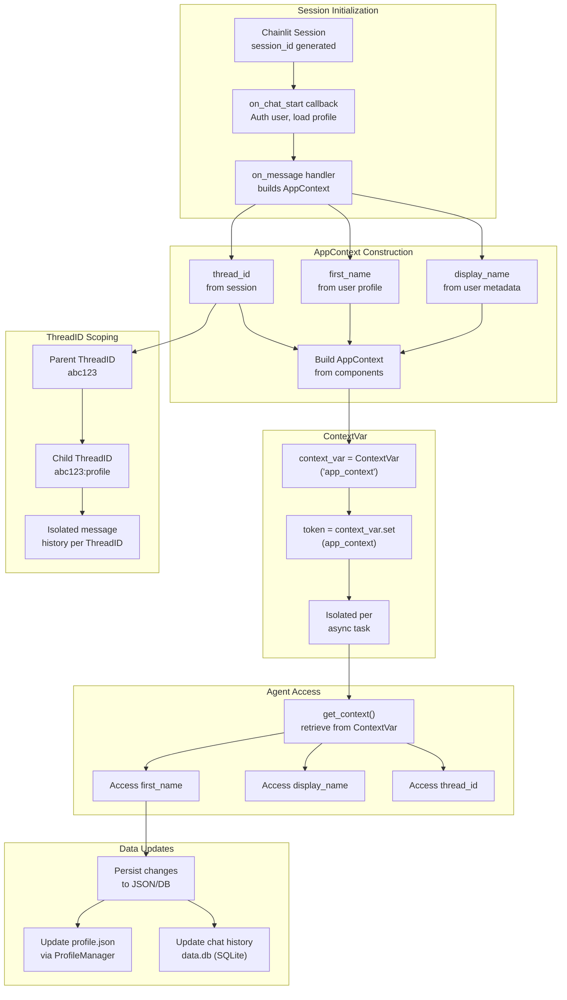
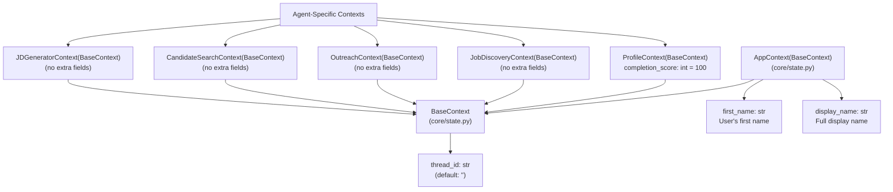
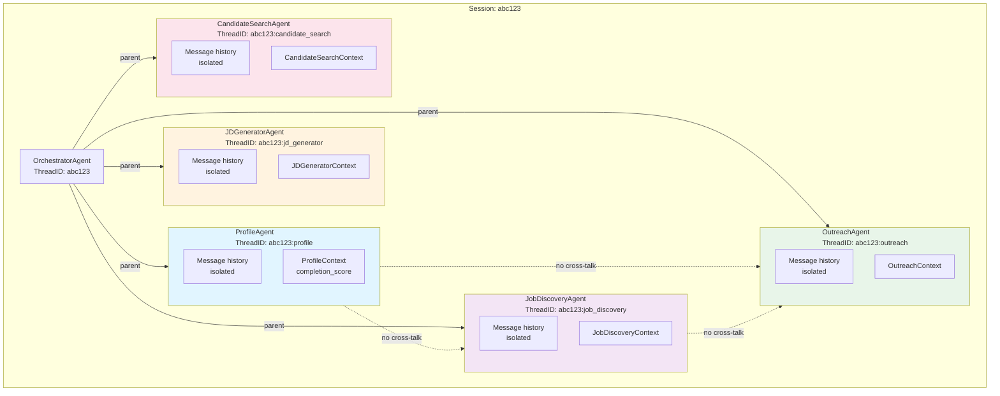
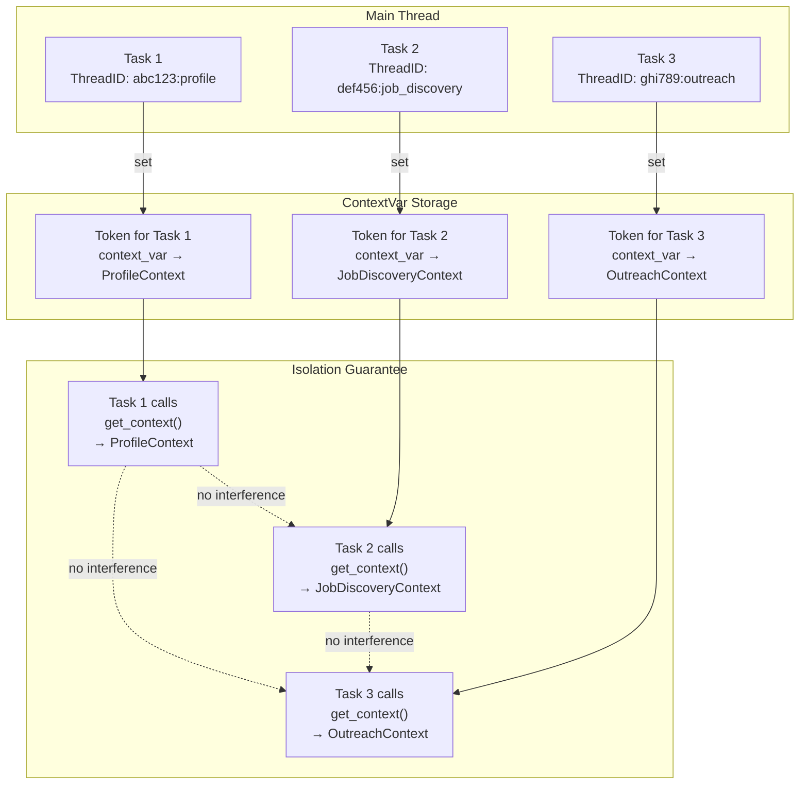
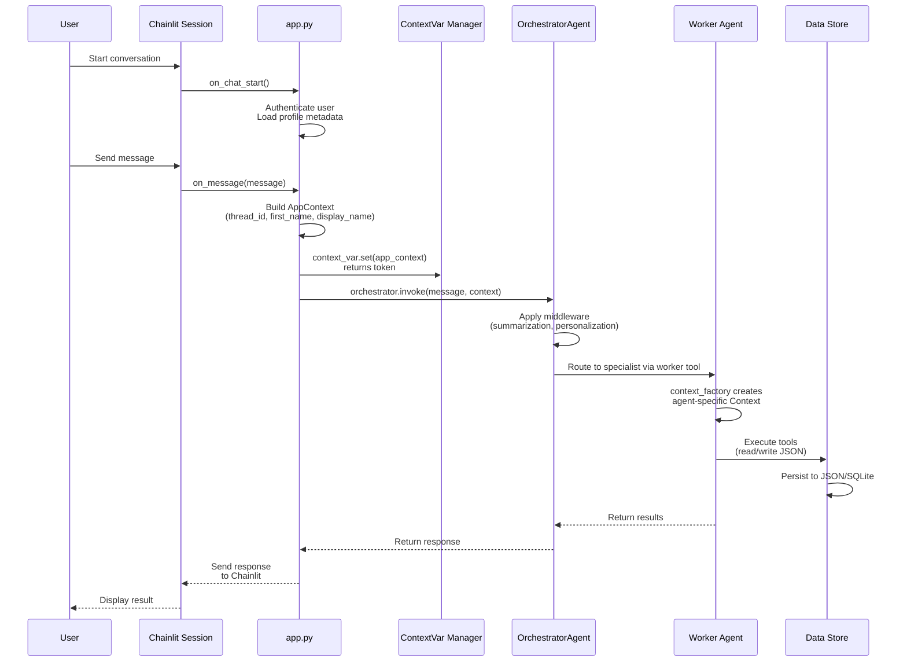
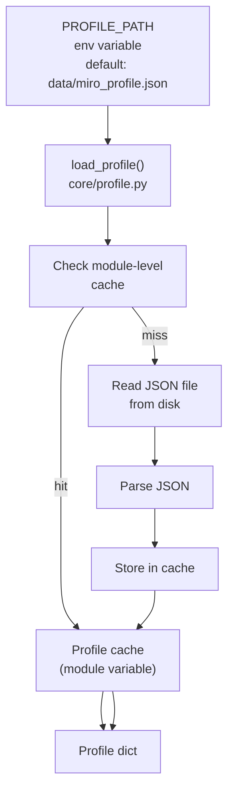
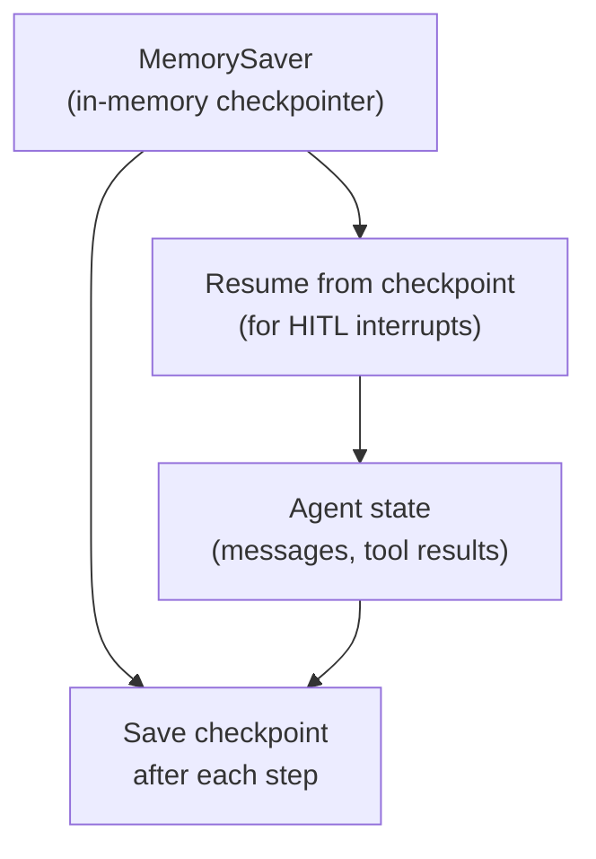

# State Management Architecture

How application state flows through the system and how threading is isolated via context variables.

## AppContext Flow

## AppContext Data Structure

## ThreadID Isolation Model

## Async Isolation via ContextVar

## State Lifecycle

## Profile Caching

## Checkpointing (LangGraph)

## Key Design Principles

1. **ContextVar Isolation** — Each async task gets its own context via contextvars
2. **ThreadID Namespacing** — `{parent}:{agent_name}` hierarchy prevents history cross-contamination
3. **Agent-Specific Contexts** — Each agent type has its own Context subclass (ProfileContext with completion_score, etc.)
4. **Profile Caching** — User profile loaded once and cached at module level
5. **LangGraph Checkpointing** — MemorySaver enables pause/resume for HITL workflows
6. **No Global State** — All context passed explicitly, enabling concurrent requests
7. **Session Binding** — AppContext tied to Chainlit session lifecycle
8. **Worker Agent Context Factory** — Each worker invocation creates a fresh agent-specific context
