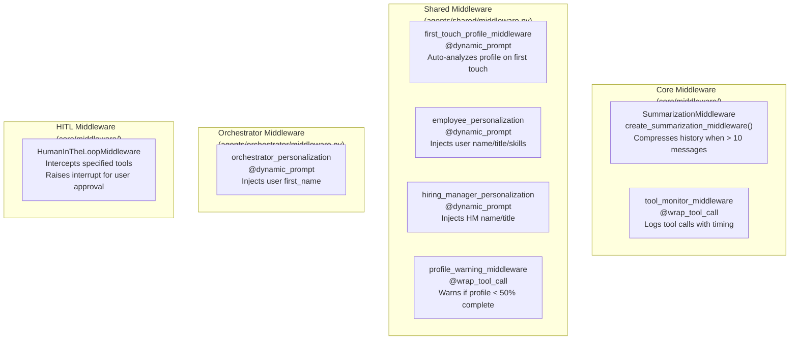
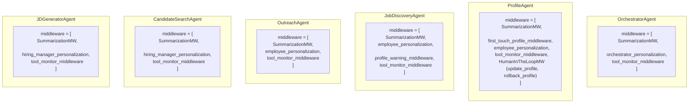
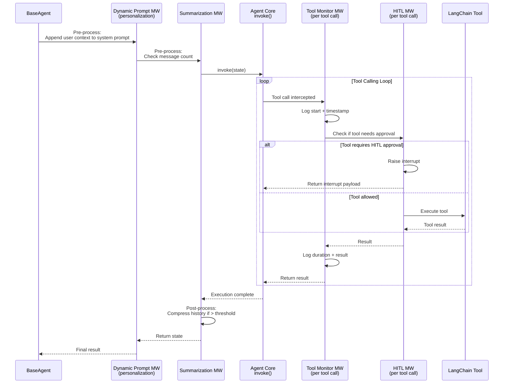
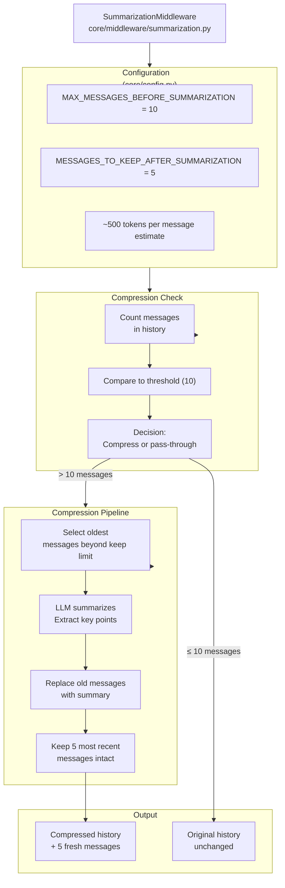
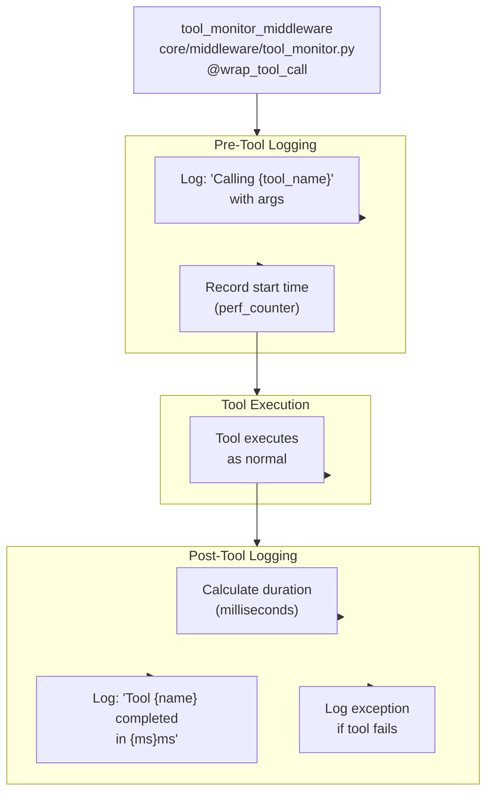
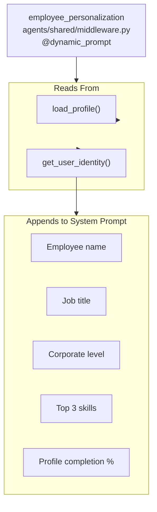
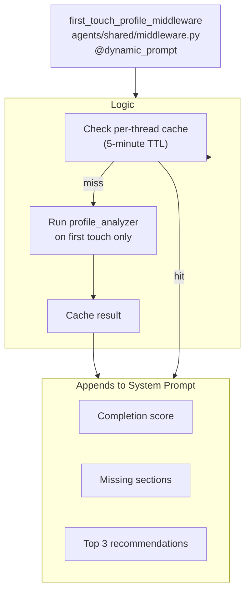
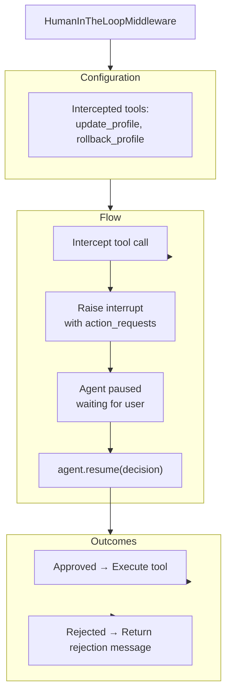

# Middleware Stack Architecture

How middleware wraps agent execution and applies cross-cutting concerns.

## Middleware Types

HR Agent uses three middleware decorator types:

| Type | Decorator | Purpose |
|------|-----------|---------|
| **dynamic_prompt** | `@dynamic_prompt` | Appends context to system prompt before agent runs |
| **wrap_tool_call** | `@wrap_tool_call` | Wraps individual tool call execution (pre/post) |
| **state middleware** | `create_*_middleware()` | Transforms full agent state (messages, history) |

## Middleware Inventory

## Middleware Composition by Agent

## Middleware Execution Flow

## Summarization Middleware Detail

## Tool Monitor Middleware Detail

## Employee Personalization Middleware

## First Touch Profile Middleware

## HITL Middleware

## Key Points

1. **Three MW Types** — `@dynamic_prompt` (pre-invoke), `@wrap_tool_call` (per-tool), state transforms (full state)
2. **Ordered Stack** — Middleware applied in order defined in AgentConfig
3. **Agent-Specific Stacks** — Different agents have different middleware combinations
4. **Employee vs HM Personalization** — Employee-facing agents get user context; HM-facing agents get HM context
5. **First Touch Analysis** — Profile agent auto-analyzes on first interaction (cached 5 min)
6. **Profile Warning** — Job Discovery warns when profile completion is low
7. **HITL Interrupts** — Profile updates require user approval before persisting
8. **History Management** — Summarization keeps token usage under control (threshold: 10 messages)
9. **Tool Monitoring** — Universal tool tracking with millisecond timing
