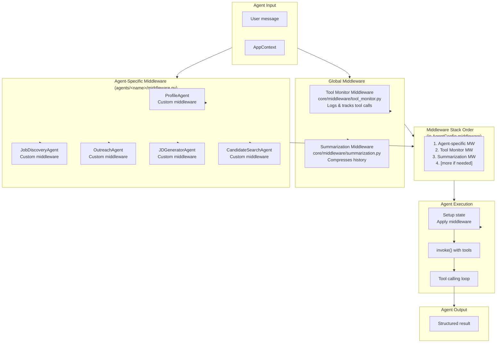
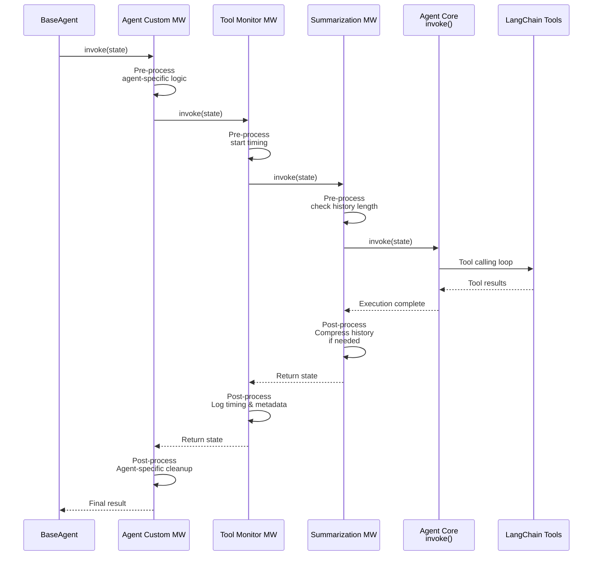
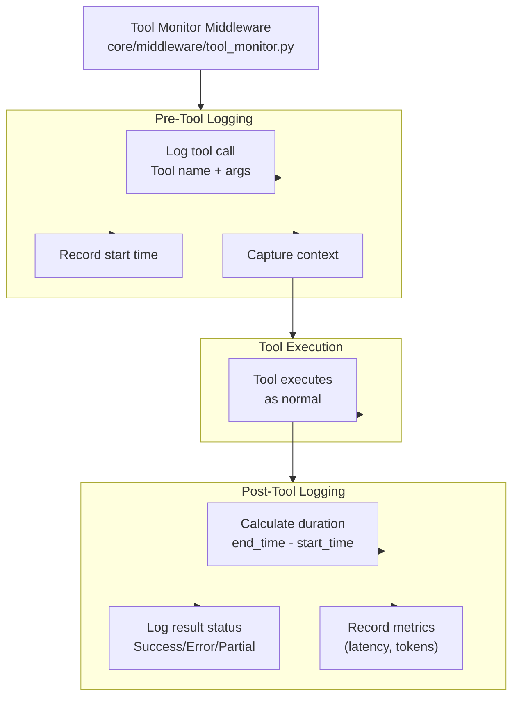
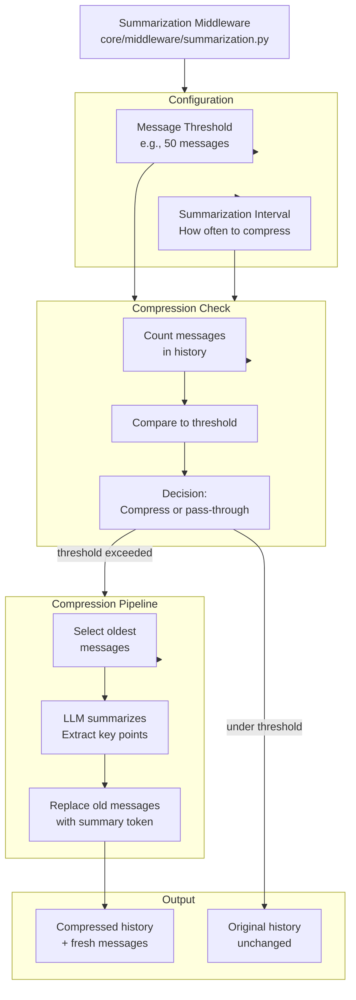
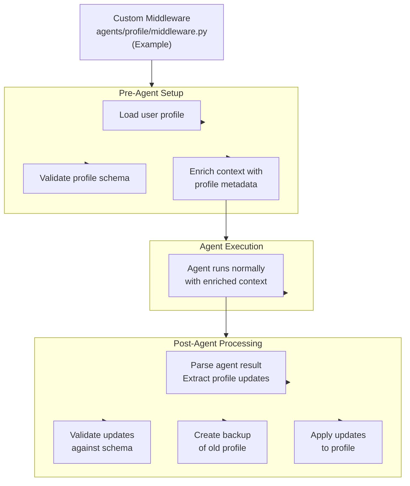
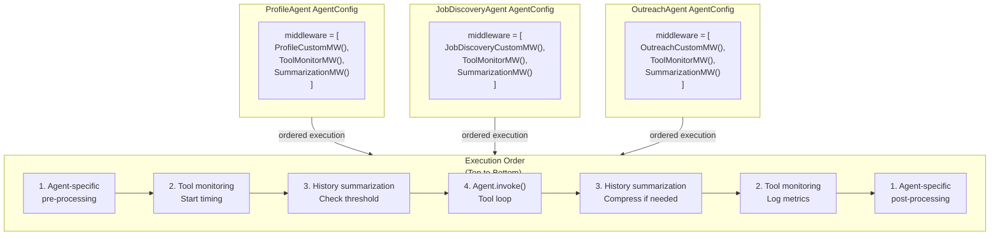
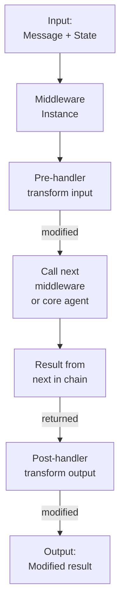

# Middleware Stack Architecture

How middleware wraps agent execution and applies cross-cutting concerns.

## Middleware Stack Composition

## Middleware Execution Flow

## Tool Monitor Middleware

## Summarization Middleware

## Custom Agent Middleware Example

## Middleware Composition

## Middleware Chain Pattern

## Key Points

1. **Ordered Stack** — Middleware applied in order defined in AgentConfig
2. **Pre/Post Processing** — Middleware can modify input and output
3. **Passthrough** — Each middleware can skip if not applicable
4. **Agent-Specific** — Different agents have different middleware
5. **Composable** — New middleware can be added without modifying agents
6. **Tool Monitoring** — Universal tool tracking and timing
7. **History Management** — Summarization keeps token usage under control
8. **Custom Logic** — Each agent can implement domain-specific concerns
