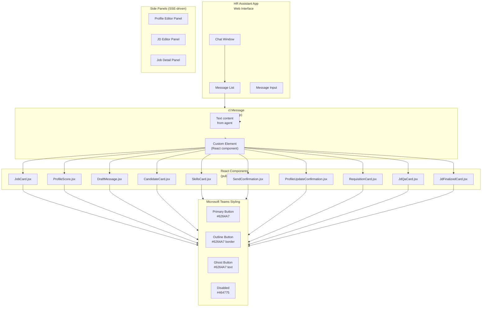
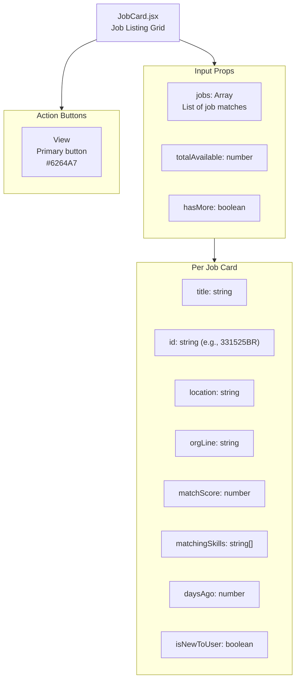
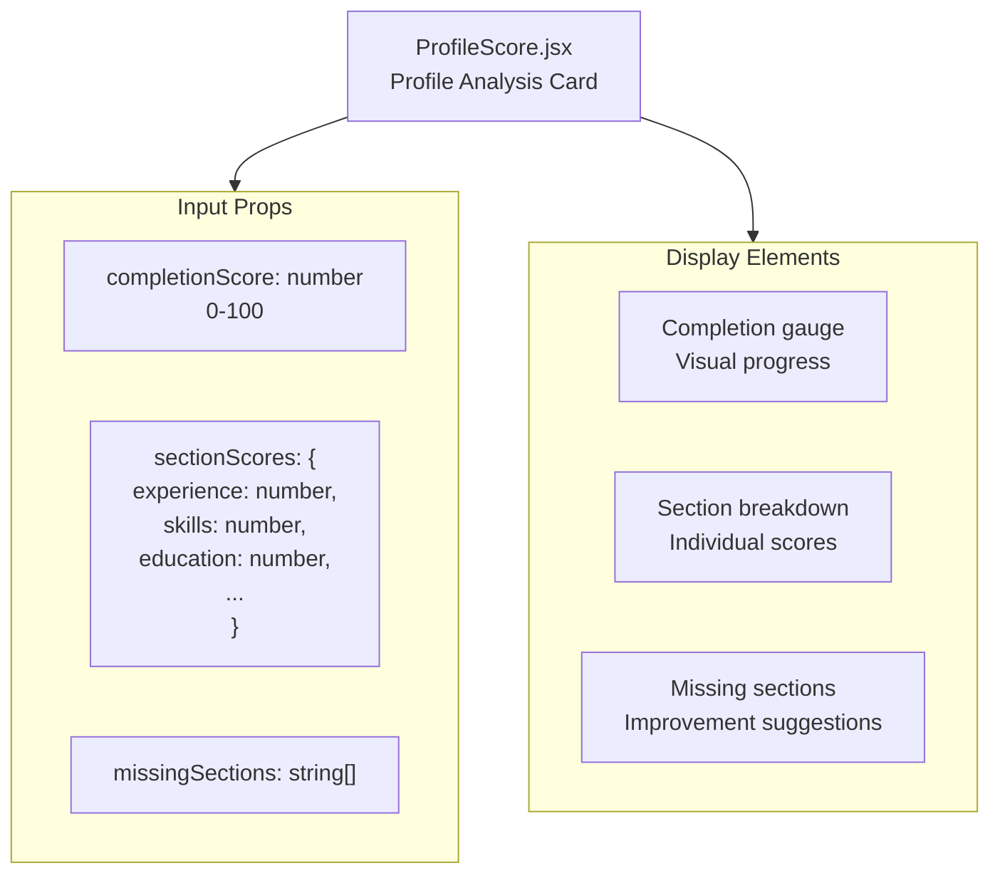
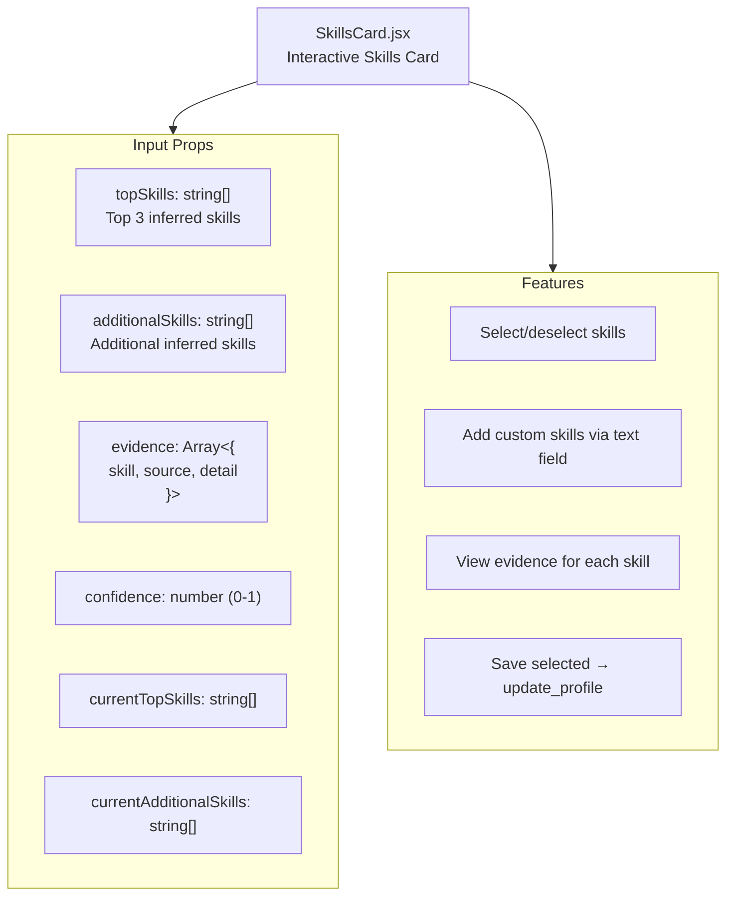
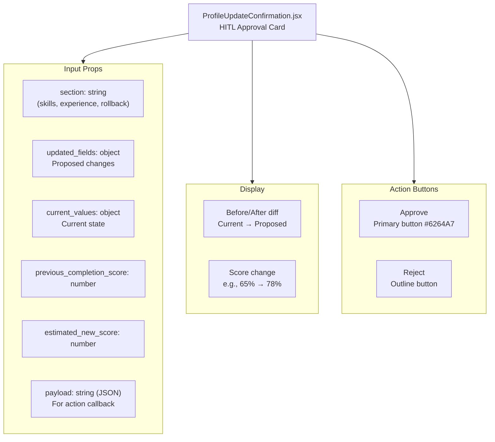
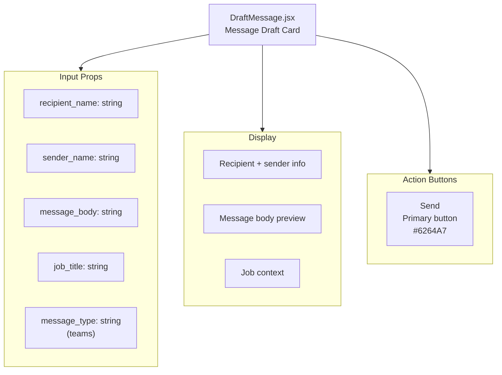
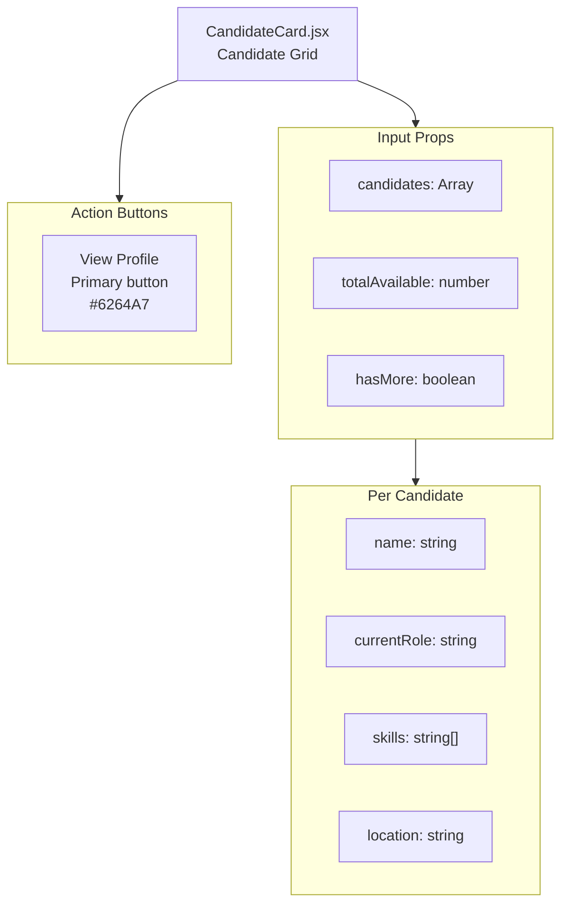
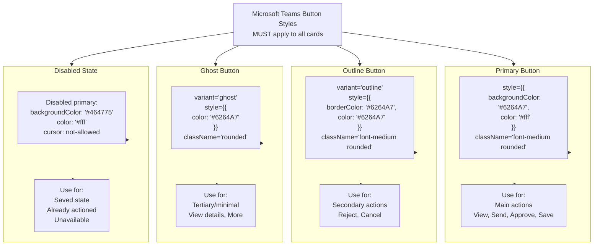
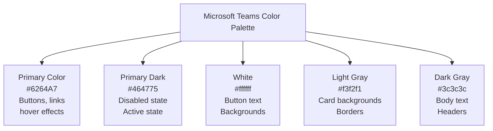
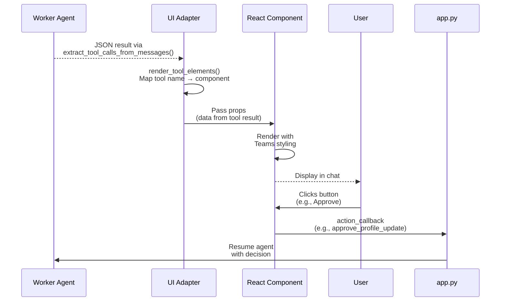

# UI Component Architecture

React components in the frontend and their styling patterns.

## Component Hierarchy

## Component → Tool Mapping

| Component | Triggered By | Purpose |
|-----------|-------------|---------|
| `JobCard.jsx` | `get_matches` | Grid of job listing cards with View button |
| `ProfileScore.jsx` | `profile_analyzer` | Completion % gauge with section breakdown |
| `SkillsCard.jsx` | `infer_skills` | Interactive skill selection with evidence citations, save to profile |
| `DraftMessage.jsx` | `draft_message` | Message preview with recipient, body, send flow |
| `SendConfirmation.jsx` | `send_message` | Confirmation with recipient name, type, timestamp |
| `ProfileUpdateConfirmation.jsx` | `update_profile` / `rollback_profile` (HITL) | Before/after diff with Approve/Reject buttons |
| `JdQaCard.jsx` | `ask_jd_qa` | Q&A answer with citations and HM contact suggestion |
| `CandidateCard.jsx` | `search_candidates` | Candidate grid with skills and match info |
| `RequisitionCard.jsx` | `get_requisition` | Job requisition details for JD authoring |
| `JdFinalizedCard.jsx` | `jd_finalize` | Finalization summary with next steps |

## JobCard Component

## ProfileScore Component

## SkillsCard Component

## ProfileUpdateConfirmation Component

## DraftMessage Component

## CandidateCard Component

## Teams Button Styling Guide

## Color Palette

## Component Data Flow

## Key Design Rules

1. **Teams Styling** — All buttons MUST follow Teams color scheme (#6264A7)
2. **Consistent Buttons** — Primary/Outline/Ghost pattern across all 10 cards
3. **Disabled State** — Use #464775 for disabled/saved state
4. **HITL Cards** — ProfileUpdateConfirmation uses Approve/Reject action callbacks
5. **Side Panels** — Profile editor, JD editor, and job details use SSE-driven panels (not card components)
6. **No Duplicate Data** — LLM prompt instructs agent NOT to repeat data shown in cards
7. **Action Handlers** — Button clicks trigger action callbacks → agent resume
8. **Pagination** — JobCard and CandidateCard support `hasMore` / `totalAvailable` for pagination
9. **Evidence Display** — SkillsCard shows citation evidence for each inferred skill
10. **Score Visualization** — ProfileScore and ProfileUpdateConfirmation show before/after completion scores
