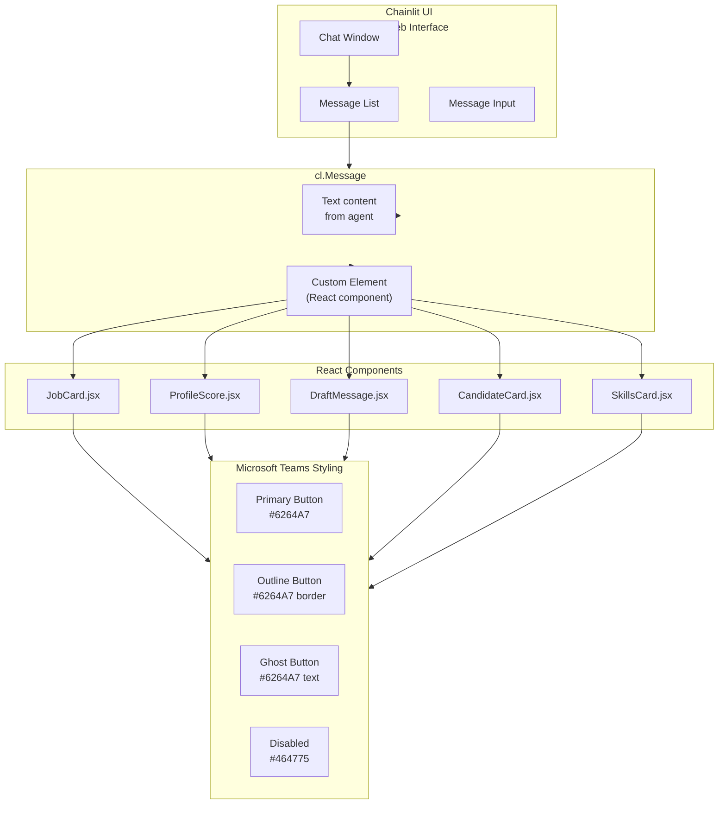
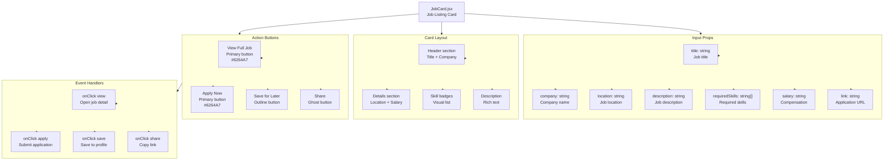
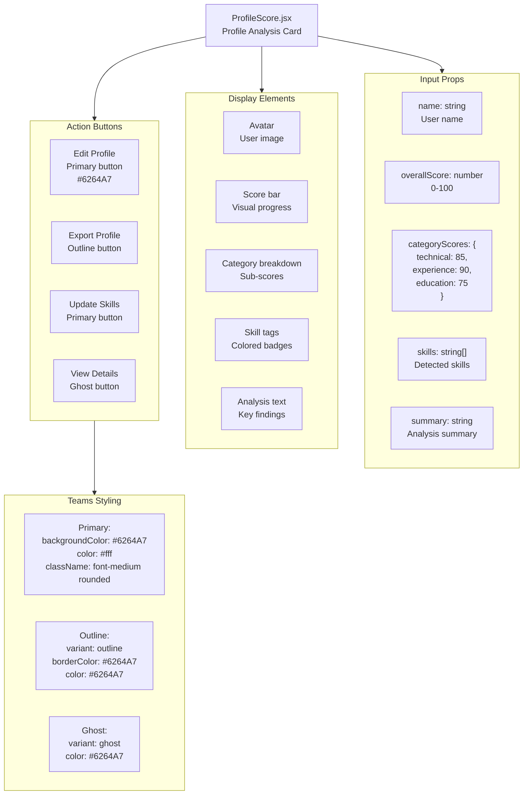
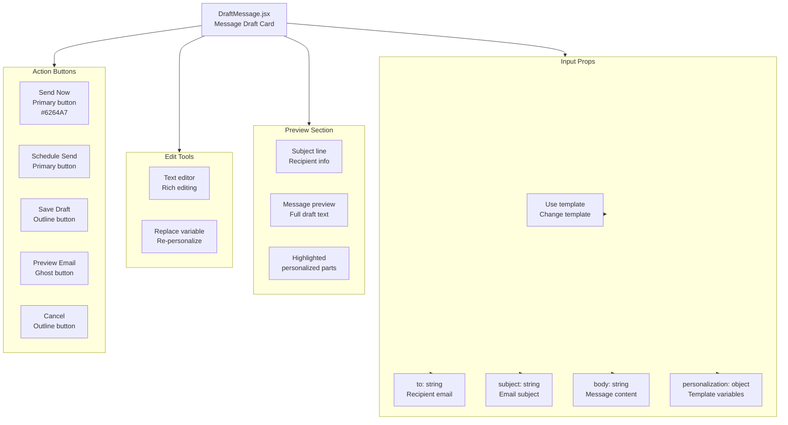
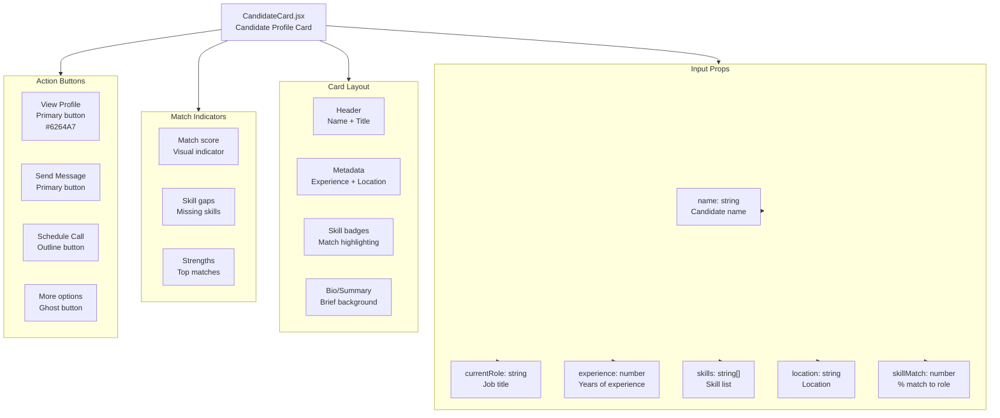
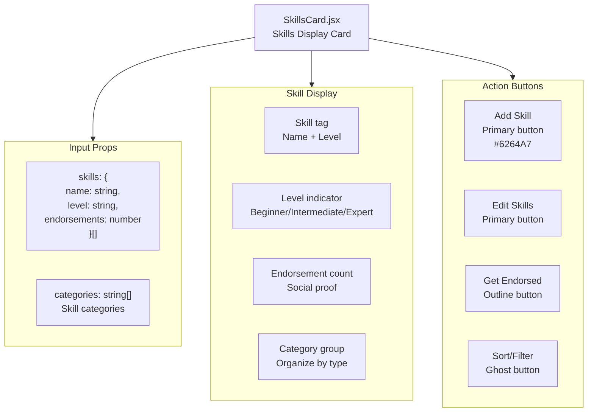
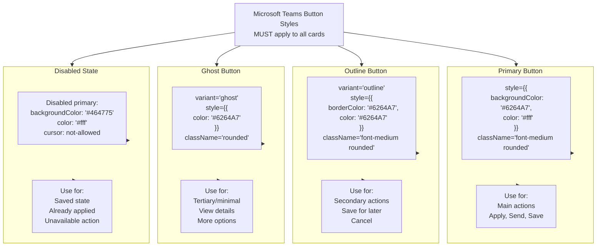
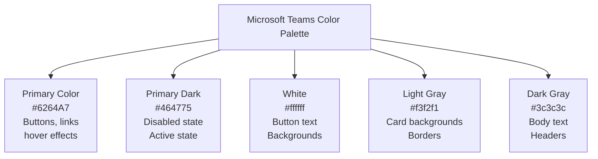
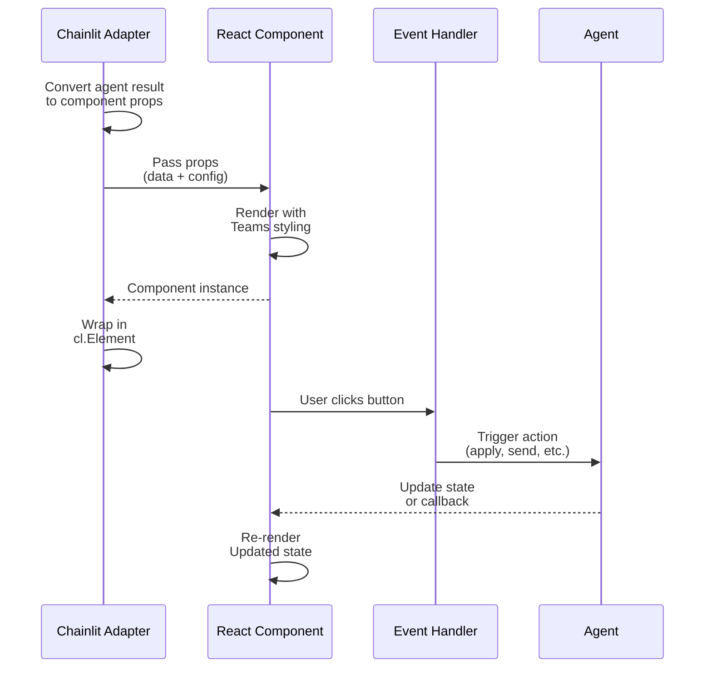

# UI Component Architecture

React components in the frontend and their styling patterns.

## Component Hierarchy

## JobCard Component

## ProfileScore Component

## DraftMessage Component

## CandidateCard Component

## SkillsCard Component

## Teams Button Styling Guide

## Color Palette

## Component Data Flow

## Key Design Rules

1. **Teams Styling** — All buttons MUST follow Teams color scheme (#6264A7)
2. **Consistent Buttons** — Primary/Outline/Ghost pattern across all cards
3. **Disabled State** — Use #464775 for disabled/saved state
4. **Responsive Layout** — Cards adapt to mobile/tablet/desktop
5. **Rich Text** — Support markdown and formatted text in descriptions
6. **Action Handlers** — Button clicks trigger agent tools or callbacks
7. **Error States** — Show validation errors inline or as toast notifications
8. **Loading States** — Spinner/skeleton while data loads
9. **Empty States** — Show meaningful message when no data
10. **Accessibility** — ARIA labels, keyboard navigation, color contrast
